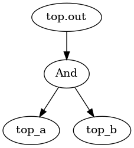
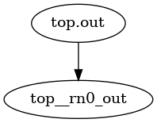
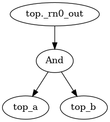

# GraphGPS4HT

[GraphGPS](https://proceedings.neurips.cc/paper_files/paper/2022/file/5d4834a159f1547b267a05a4e2b7cf5e-Paper-Conference.pdf) is a tool for Graph ML. 

**NOTE:** 
1. **[GPS++](https://arxiv.org/pdf/2212.02229.pdf) is an improved version of GraphGPS mainly for molecular classifications.**
2. **[Exphormer](https://github.com/hamed1375/Exphormer) is an improved version of GraphGPS agnostic of the application.**
3. **ZINC and other benchmarks used in the GraphGPS tool-flow were proposed in Vijay's benchmarking paper.**

<details>
  
  <summary> 
    
  ## Goals of Project:
    
  </summary>

1. **Train GraphGPS on HT dataset**

    a) Phases through which the training goes (**GOT A HIGH-LEVEL IDEA FROM IMPLEMENTATION PERSPECTIVE; EXPLAINED BELOW ALL THE INFORMATION I HAVE DISCOVERED SO FAR ABOUT THE OVERALL WORKFLOW OF GRAPHGPS; I WANT MORE CLARITY**) (**Done by $\color{red}{28.08.2023}$**)

    b) Where are the hyperparameters set?(**Done by $\color{red}{28.08.023}$**)

    c) Understand the meaning of the hyperparameters (**NEED TO DICUSS WITH VIJAY ABOUT THE HYPERPARAMETERS THAT I DIDN'T UNDERSTAND**)

    d) How a dataset is called? (**Done by $\color{red}{08.09.2023}$**)

    e) How to add a new dataset to GraphGPS? How to call the new dataset? (**Done by $\color{red}{08.09.2023}$**)

    f) Convert the TrustHub benchmarks using the ckt-to-graph conversion code of HW2VEC (**Work-In-Progress**)

    g) Train GraphGPS using the TrustHub graphs. Tune hyperparameters. (**Near Future**)

3. **Compare with other GNN-based tools (trained on the same dataset and tested on the same dataset).**
4. **Proliferate the TrustHub dataset using the [GAINESIS tool](https://www.mdpi.com/2079-9292/11/2/245), [S. Bhunia's tool](https://arxiv.org/pdf/2204.08580.pdf) and another tool (can't recall the title; need to check my collection of papers)**
5. **Extend the work to node classification**
6. **Improve the GraphGPS tool - for HT detection or in general**

</details>

# Weekly Research Updates

<details>
  <summary> 
    
  ### Update as of August 28, 2023
  
  </summary>

  <details>
    <summary> 
    
  ## Workflow of GraphGPS (in Short):

     </summary>

**Parse arguments of the execution command from CLI** 

⬇️

**Extract the location of configuration file from the list of arguments** 

⬇️

**Set default values of parameters of the experiment** 

⬇️

**Load configurations from the above configuration file  and also any configuration specifically mentioned  through command line** 

 ⬇️

**Set output directory where the results are stored** 

⬇️

**Combine the configurations specified in the user-given configuration file and the default values of unspecified configurations from `graphgym/config.py` and from the configuration files in `graphgps/config` into the `config.yaml` file in `custom_out_dir`**

⬇️

**create run-directory (in `custom_out_dir`) during each run of experiment** 

⬇️

**create dataset loader, a logger that logs info in `logging.log` inside the run-directory, create model, optimizer and an LR scheduler**

⬇️

**Perform training**

⬇️

**Display best epoch and the corresponding performances on training, validation and test sets.**

  </details>

<details>
  
<summary>
  
## Steps in GrahGPS Workflow (in Detail):

</summary>

1. Load cmd line args
```
args = parse_args()
print (args)
```
args: `Namespace(cfg_file='configs/GPS/zinc-GPS+RWSE.yaml', repeat=1, mark_done=False, opts=['wandb.use', 'False'])`

Parses the command line for arguments like `cfg` - configuration file path, `repeat` - the number of repeated jobs, `mark_done` - marking yaml as done after a job has finished, `opt` - configuration options.

The configurations for the executed experiment (`python main.py --cfg configs/GPS/zinc-GPS+RWSE.yaml  wandb.use False`) are given in the file: `configs/GPS/zinc-GPS+RWSE.yaml`

The default values of these and other unspecified parameters in this file are stated in the `set_cfg(cfg)` method of the file:  https://github.com/snap-stanford/GraphGym/blob/master/graphgym/config.py

Note that some of the parameters in `configs/GPS/zinc-GPS+RWSE.yaml` are custom defined for this project and not present in the `set_cfg` method. The default values of these custom parameters are stated in https://github.com/rampasek/GraphGPS/tree/main/graphgps/config

The `set_cfg()` method combines the default values of the parameters of GraphGym and those of the custom parameters of the project. This is done by the following code snippet in `set_cfg()`:

```
for func in register.config_dict.values():
        func(cfg)
```
:thinking: :thinking: :thinking:<span style="color:red">**I AM STILL NOT CLEAR ABOUT HOW THE** </span> `config_dict` <span style="color:red"> **DICTIONARY IS POPULATED WITH KEYS AND VALUES. WHICH CODE CARRIES IT OUT?** </span>:thinking: :thinking: :thinking:

2. Load config file
```
    set_cfg(cfg)
    load_cfg(cfg, args)
    custom_set_out_dir(cfg, args.cfg_file, cfg.name_tag)
    dump_cfg(cfg)
```
**set_cfg(cfg)**: Sets default values of parameters of the experiment. The default values of these and other unspecified parameters in this file are stated in the `set_cfg(cfg)` method of the file:  https://github.com/snap-stanford/GraphGym/blob/master/graphgym/config.py

Note that the parameters in 'configs/GPS/zinc-GPS+RWSE.yaml' custom defined for this project are not present in the `set_cfg` method of GraphGym. The default values of these custom parameters are stated in the .py files of https://github.com/rampasek/GraphGPS/tree/main/graphgps/config

**load_cfg(cfg, args)**: Loads configurations from the configuration file mentioned in command line and also any configuration specifically mentioned  through command line.

**custom_set_out_dir(cfg, args.cfg_file, cfg.name_tag)**: result is the `custom_out_dir` (= 'results/' + 'zinc-GPS+RWSE')

**dump_cfg(cfg)**: Combines the configurations specified in the configuration file (e.g. 'configs/GPS/zinc-GPS+RWSE.yaml'; argument in CLI)  and the default values of unspecified configurations from `graphgym/config.py` to `custom_out_dir`.

3. `custom_set_run_dir(cfg, run_id)`: it sets custom output directory for each experiment run. Inside the custom output directory (here, 'results/zinc-GPS+RWSE'), a separate directory is created during each run. The title of this directory is the run-id.

4. `set_printing`: set printing options

5. Set split index (to choose which split to use in case of multiple available splits), seed, and run id as per the current run.

6. If configured for pretrained model, update `cfg` from the pretrained-model configurations in `pretrained_cfg_fname` (= `osp.join(cfg.pretrained.dir, 'config.yaml'`); e.g. `/home/sumandeb/GraphGPS/pretrained/pcqm4m-GPS+RWSE.deep/config.yaml`). This is done by `load_pretrained_model_cfg(cfg)` in `GraphGPS/graphgps/finetuning.py`

7. `seed_everything`: sets the seed for generating random numbers in pytorch

8. `create_loader()`: creates loaders for each dataset. It is in `GraphGym/graphgym/loader.py`

9. `create_logger()`: create a list of logger objects. It is in `GraphGPS/graphgps/logger.py`

10. `create_model()`: Creates and returns a Python dictionary to register a model. It is in `GraphGym/graphgym/model_builder.py`. Result of `print(f'model:{model}')` is given at the end of this note.

11. If pretrained model is provided, `init_model_from_pretrained()`: uploads the `pretrained_dict` to the `state_dict` of the model (created using `create_model()`).

12. `create_optimizer()`: It is located in `GraphGym/graphgym/optimizer.py`. It loads an ADAM or SGD optimizer as per the configurations (`config.optim`) in `results/'benchmarkname'/config.yaml`

13. `create_scheduler()`: Creates a config-driven LR scheduler. It is located in `GraphGym/graphgym/optimizer.py`

14. ```
    logging.info(model)
    logging.info(cfg)
    cfg.params = params_count(model)
    logging.info('Num parameters: %s', cfg.params)```

It logs the model, configurations and the given string+variable (`cfg.params`) into `results/'benchmark-name'/logging.log`. 
Note:`logging.info(f"some_string {some_variable}")`: Python provides a module called `logging` for logging messages. 


15. Perform training: Executed by `train_dict[cfg.train.mode](loggers, loaders, model, optimizer,scheduler)`

16. `agg_runs()`: aggregates the training, validation and test results of each epoch and prints the best epoch and the corresponding statistics.


Upon executing the command `python main.py --cfg configs/GPS/zinc-GPS+RWSE.yaml  wandb.use False`,  the details of the training, validation, testing of an epoch , say epoch 1291, are output as:
```
train: {'epoch': 1291, 'time_epoch': 18.93798, 'eta': 13315.24609, 'eta_hours': 3.69868, 'loss': 0.02500516, 'lr': 0.00029223, 'params': 423717, 'time_iter': 0.0605, 'mae': 0.02501, 'r2': 0.9997, 'spearmanr': 0.99983, 'mse': 0.00122, 'rmse': 0.03492}

val: {'epoch': 1291, 'time_epoch': 0.4733, 'loss': 0.08178774, 'lr': 0, 'params': 423717, 'time_iter': 0.01479, 'mae': 0.08179, 'r2': 0.96319, 'spearmanr': 0.99765, 'mse': 0.145, 'rmse': 0.38079}

test: {'epoch': 1291, 'time_epoch': 0.46763, 'loss': 0.07286437, 'lr': 0, 'params': 423717, 'time_iter': 0.01461, 'mae': 0.07286, 'r2': 0.99062, 'spearmanr': 0.99668, 'mse': 0.03816, 'rmse': 0.19534}
```

Aslo, the best epoch so far (at any point of training) and its essential details are summarised as follows, for each epoch until the next best epoch is found:

```
> Epoch 1999: took 20.3s (avg 19.7s) | Best so far: epoch 1291	train_loss: 0.0250 train_mae: 0.0250	val_loss: 0.0818 val_mae: 0.0818	test_loss: 0.0729 test_mae: 0.0729
```


 


## Example Configuration File: configs/GPS/zinc-GPS+RWSE.yaml

```
out_dir: results
metric_best: mae 
metric_agg: argmin 
wandb: 
  use: True 	#additional
  project: ZINC #additional
dataset:
  format: PyG-ZINC
  name: subset
  task: graph
  task_type: regression
  transductive: False
  node_encoder: True
  node_encoder_name: TypeDictNode+RWSE
  node_encoder_num_types: 28
  node_encoder_bn: False
  edge_encoder: True
  edge_encoder_name: TypeDictEdge
  edge_encoder_num_types: 4
  edge_encoder_bn: False
posenc_RWSE:
  enable: True 				#additional
  kernel:
    times_func: range(1,21) #additional
  model: Linear 			#additional
  dim_pe: 28 				#additional
  raw_norm_type: BatchNorm 	#additional
train:
  mode: custom
  batch_size: 32
  eval_period: 1
  ckpt_period: 100
model:
  type: GPSModel
  loss_fun: l1
  edge_decoding: dot
  graph_pooling: add
gt:
  layer_type: GINE+Transformer  # CustomGatedGCN+Performer 		#additional
  layers: 10 													#additional
  n_heads: 4 													#additional
  dim_hidden: 64  # `gt.dim_hidden` must match `gnn.dim_inner` 	#additional
  dropout: 0.0 													#additional
  attn_dropout: 0.5 											#additional
  layer_norm: False 											#additional
  batch_norm: True 												#additional
gnn:
  head: san_graph
  layers_pre_mp: 0
  layers_post_mp: 3  # Not used when `gnn.head: san_graph`
  dim_inner: 64  # `gt.dim_hidden` must match `gnn.dim_inner`
  batchnorm: True
  act: relu
  dropout: 0.0
  agg: mean
  normalize_adj: False
optim:
```

### GNN Model: 

**Output of print(f'model:{model}')**

**🤔 🤔 NEED TO DISCUSS WITH VIJAY TO UNDERSTAND THE MEANING OF EACH OF THE FOLLOWING DETAILS 🤔 🤔**

```
model:GraphGymModule(
  (model): GPSModel(
    (encoder): FeatureEncoder(
      (node_encoder): Concat2NodeEncoder(
        (encoder1): AtomEncoder(
          (atom_embedding_list): ModuleList(
            (0): Embedding(119, 236)
            (1): Embedding(5, 236)
            (2): Embedding(12, 236)
            (3): Embedding(12, 236)
            (4): Embedding(10, 236)
            (5): Embedding(6, 236)
            (6): Embedding(6, 236)
            (7): Embedding(2, 236)
            (8): Embedding(2, 236)
          )
        )
        (encoder2): RWSENodeEncoder(
          (raw_norm): BatchNorm1d(16, eps=1e-05, momentum=0.1, affine=True, track_running_stats=True)
          (pe_encoder): Linear(in_features=16, out_features=20, bias=True)
        )
      )
      (edge_encoder): BondEncoder(
        (bond_embedding_list): ModuleList(
          (0): Embedding(5, 256)
          (1): Embedding(6, 256)
          (2): Embedding(2, 256)
        )
      )
    )
    (layers): Sequential(
      (0): GPSLayer(
        summary: dim_h=256, local_gnn_type=CustomGatedGCN, global_model_type=Transformer, heads=8
        (local_model): GatedGCNLayer()
        (self_attn): MultiheadAttention(
          (out_proj): NonDynamicallyQuantizableLinear(in_features=256, out_features=256, bias=True)
        )
        (norm1_local): BatchNorm1d(256, eps=1e-05, momentum=0.1, affine=True, track_running_stats=True)
        (norm1_attn): BatchNorm1d(256, eps=1e-05, momentum=0.1, affine=True, track_running_stats=True)
        (dropout_local): Dropout(p=0.1, inplace=False)
        (dropout_attn): Dropout(p=0.1, inplace=False)
        (ff_linear1): Linear(in_features=256, out_features=512, bias=True)
        (ff_linear2): Linear(in_features=512, out_features=256, bias=True)
        (act_fn_ff): GELU(approximate='none')
        (norm2): BatchNorm1d(256, eps=1e-05, momentum=0.1, affine=True, track_running_stats=True)
        (ff_dropout1): Dropout(p=0.1, inplace=False)
        (ff_dropout2): Dropout(p=0.1, inplace=False)
      )
      (1): GPSLayer(
        summary: dim_h=256, local_gnn_type=CustomGatedGCN, global_model_type=Transformer, heads=8
        (local_model): GatedGCNLayer()
        (self_attn): MultiheadAttention(
          (out_proj): NonDynamicallyQuantizableLinear(in_features=256, out_features=256, bias=True)
        )
        (norm1_local): BatchNorm1d(256, eps=1e-05, momentum=0.1, affine=True, track_running_stats=True)
        (norm1_attn): BatchNorm1d(256, eps=1e-05, momentum=0.1, affine=True, track_running_stats=True)
        (dropout_local): Dropout(p=0.1, inplace=False)
        (dropout_attn): Dropout(p=0.1, inplace=False)
        (ff_linear1): Linear(in_features=256, out_features=512, bias=True)
        (ff_linear2): Linear(in_features=512, out_features=256, bias=True)
        (act_fn_ff): GELU(approximate='none')
        (norm2): BatchNorm1d(256, eps=1e-05, momentum=0.1, affine=True, track_running_stats=True)
        (ff_dropout1): Dropout(p=0.1, inplace=False)
        (ff_dropout2): Dropout(p=0.1, inplace=False)
      )
      (2): GPSLayer(
        summary: dim_h=256, local_gnn_type=CustomGatedGCN, global_model_type=Transformer, heads=8
        (local_model): GatedGCNLayer()
        (self_attn): MultiheadAttention(
          (out_proj): NonDynamicallyQuantizableLinear(in_features=256, out_features=256, bias=True)
        )
        (norm1_local): BatchNorm1d(256, eps=1e-05, momentum=0.1, affine=True, track_running_stats=True)
        (norm1_attn): BatchNorm1d(256, eps=1e-05, momentum=0.1, affine=True, track_running_stats=True)
        (dropout_local): Dropout(p=0.1, inplace=False)
        (dropout_attn): Dropout(p=0.1, inplace=False)
        (ff_linear1): Linear(in_features=256, out_features=512, bias=True)
        (ff_linear2): Linear(in_features=512, out_features=256, bias=True)
        (act_fn_ff): GELU(approximate='none')
        (norm2): BatchNorm1d(256, eps=1e-05, momentum=0.1, affine=True, track_running_stats=True)
        (ff_dropout1): Dropout(p=0.1, inplace=False)
        (ff_dropout2): Dropout(p=0.1, inplace=False)
      )
      (3): GPSLayer(
        summary: dim_h=256, local_gnn_type=CustomGatedGCN, global_model_type=Transformer, heads=8
        (local_model): GatedGCNLayer()
        (self_attn): MultiheadAttention(
          (out_proj): NonDynamicallyQuantizableLinear(in_features=256, out_features=256, bias=True)
        )
        (norm1_local): BatchNorm1d(256, eps=1e-05, momentum=0.1, affine=True, track_running_stats=True)
        (norm1_attn): BatchNorm1d(256, eps=1e-05, momentum=0.1, affine=True, track_running_stats=True)
        (dropout_local): Dropout(p=0.1, inplace=False)
        (dropout_attn): Dropout(p=0.1, inplace=False)
        (ff_linear1): Linear(in_features=256, out_features=512, bias=True)
        (ff_linear2): Linear(in_features=512, out_features=256, bias=True)
        (act_fn_ff): GELU(approximate='none')
        (norm2): BatchNorm1d(256, eps=1e-05, momentum=0.1, affine=True, track_running_stats=True)
        (ff_dropout1): Dropout(p=0.1, inplace=False)
        (ff_dropout2): Dropout(p=0.1, inplace=False)
      )
      (4): GPSLayer(
        summary: dim_h=256, local_gnn_type=CustomGatedGCN, global_model_type=Transformer, heads=8
        (local_model): GatedGCNLayer()
        (self_attn): MultiheadAttention(
          (out_proj): NonDynamicallyQuantizableLinear(in_features=256, out_features=256, bias=True)
        )
        (norm1_local): BatchNorm1d(256, eps=1e-05, momentum=0.1, affine=True, track_running_stats=True)
        (norm1_attn): BatchNorm1d(256, eps=1e-05, momentum=0.1, affine=True, track_running_stats=True)
        (dropout_local): Dropout(p=0.1, inplace=False)
        (dropout_attn): Dropout(p=0.1, inplace=False)
        (ff_linear1): Linear(in_features=256, out_features=512, bias=True)
        (ff_linear2): Linear(in_features=512, out_features=256, bias=True)
        (act_fn_ff): GELU(approximate='none')
        (norm2): BatchNorm1d(256, eps=1e-05, momentum=0.1, affine=True, track_running_stats=True)
        (ff_dropout1): Dropout(p=0.1, inplace=False)
        (ff_dropout2): Dropout(p=0.1, inplace=False)
      )
      (5): GPSLayer(
        summary: dim_h=256, local_gnn_type=CustomGatedGCN, global_model_type=Transformer, heads=8
        (local_model): GatedGCNLayer()
        (self_attn): MultiheadAttention(
          (out_proj): NonDynamicallyQuantizableLinear(in_features=256, out_features=256, bias=True)
        )
        (norm1_local): BatchNorm1d(256, eps=1e-05, momentum=0.1, affine=True, track_running_stats=True)
        (norm1_attn): BatchNorm1d(256, eps=1e-05, momentum=0.1, affine=True, track_running_stats=True)
        (dropout_local): Dropout(p=0.1, inplace=False)
        (dropout_attn): Dropout(p=0.1, inplace=False)
        (ff_linear1): Linear(in_features=256, out_features=512, bias=True)
        (ff_linear2): Linear(in_features=512, out_features=256, bias=True)
        (act_fn_ff): GELU(approximate='none')
        (norm2): BatchNorm1d(256, eps=1e-05, momentum=0.1, affine=True, track_running_stats=True)
        (ff_dropout1): Dropout(p=0.1, inplace=False)
        (ff_dropout2): Dropout(p=0.1, inplace=False)
      )
      (6): GPSLayer(
        summary: dim_h=256, local_gnn_type=CustomGatedGCN, global_model_type=Transformer, heads=8
        (local_model): GatedGCNLayer()
        (self_attn): MultiheadAttention(
          (out_proj): NonDynamicallyQuantizableLinear(in_features=256, out_features=256, bias=True)
        )
        (norm1_local): BatchNorm1d(256, eps=1e-05, momentum=0.1, affine=True, track_running_stats=True)
        (norm1_attn): BatchNorm1d(256, eps=1e-05, momentum=0.1, affine=True, track_running_stats=True)
        (dropout_local): Dropout(p=0.1, inplace=False)
        (dropout_attn): Dropout(p=0.1, inplace=False)
        (ff_linear1): Linear(in_features=256, out_features=512, bias=True)
        (ff_linear2): Linear(in_features=512, out_features=256, bias=True)
        (act_fn_ff): GELU(approximate='none')
        (norm2): BatchNorm1d(256, eps=1e-05, momentum=0.1, affine=True, track_running_stats=True)
        (ff_dropout1): Dropout(p=0.1, inplace=False)
        (ff_dropout2): Dropout(p=0.1, inplace=False)
      )
      (7): GPSLayer(
        summary: dim_h=256, local_gnn_type=CustomGatedGCN, global_model_type=Transformer, heads=8
        (local_model): GatedGCNLayer()
        (self_attn): MultiheadAttention(
          (out_proj): NonDynamicallyQuantizableLinear(in_features=256, out_features=256, bias=True)
        )
        (norm1_local): BatchNorm1d(256, eps=1e-05, momentum=0.1, affine=True, track_running_stats=True)
        (norm1_attn): BatchNorm1d(256, eps=1e-05, momentum=0.1, affine=True, track_running_stats=True)
        (dropout_local): Dropout(p=0.1, inplace=False)
        (dropout_attn): Dropout(p=0.1, inplace=False)
        (ff_linear1): Linear(in_features=256, out_features=512, bias=True)
        (ff_linear2): Linear(in_features=512, out_features=256, bias=True)
        (act_fn_ff): GELU(approximate='none')
        (norm2): BatchNorm1d(256, eps=1e-05, momentum=0.1, affine=True, track_running_stats=True)
        (ff_dropout1): Dropout(p=0.1, inplace=False)
        (ff_dropout2): Dropout(p=0.1, inplace=False)
      )
      (8): GPSLayer(
        summary: dim_h=256, local_gnn_type=CustomGatedGCN, global_model_type=Transformer, heads=8
        (local_model): GatedGCNLayer()
        (self_attn): MultiheadAttention(
          (out_proj): NonDynamicallyQuantizableLinear(in_features=256, out_features=256, bias=True)
        )
        (norm1_local): BatchNorm1d(256, eps=1e-05, momentum=0.1, affine=True, track_running_stats=True)
        (norm1_attn): BatchNorm1d(256, eps=1e-05, momentum=0.1, affine=True, track_running_stats=True)
        (dropout_local): Dropout(p=0.1, inplace=False)
        (dropout_attn): Dropout(p=0.1, inplace=False)
        (ff_linear1): Linear(in_features=256, out_features=512, bias=True)
        (ff_linear2): Linear(in_features=512, out_features=256, bias=True)
        (act_fn_ff): GELU(approximate='none')
        (norm2): BatchNorm1d(256, eps=1e-05, momentum=0.1, affine=True, track_running_stats=True)
        (ff_dropout1): Dropout(p=0.1, inplace=False)
        (ff_dropout2): Dropout(p=0.1, inplace=False)
      )
      (9): GPSLayer(
        summary: dim_h=256, local_gnn_type=CustomGatedGCN, global_model_type=Transformer, heads=8
        (local_model): GatedGCNLayer()
        (self_attn): MultiheadAttention(
          (out_proj): NonDynamicallyQuantizableLinear(in_features=256, out_features=256, bias=True)
        )
        (norm1_local): BatchNorm1d(256, eps=1e-05, momentum=0.1, affine=True, track_running_stats=True)
        (norm1_attn): BatchNorm1d(256, eps=1e-05, momentum=0.1, affine=True, track_running_stats=True)
        (dropout_local): Dropout(p=0.1, inplace=False)
        (dropout_attn): Dropout(p=0.1, inplace=False)
        (ff_linear1): Linear(in_features=256, out_features=512, bias=True)
        (ff_linear2): Linear(in_features=512, out_features=256, bias=True)
        (act_fn_ff): GELU(approximate='none')
        (norm2): BatchNorm1d(256, eps=1e-05, momentum=0.1, affine=True, track_running_stats=True)
        (ff_dropout1): Dropout(p=0.1, inplace=False)
        (ff_dropout2): Dropout(p=0.1, inplace=False)
      )
      (10): GPSLayer(
        summary: dim_h=256, local_gnn_type=CustomGatedGCN, global_model_type=Transformer, heads=8
        (local_model): GatedGCNLayer()
        (self_attn): MultiheadAttention(
          (out_proj): NonDynamicallyQuantizableLinear(in_features=256, out_features=256, bias=True)
        )
        (norm1_local): BatchNorm1d(256, eps=1e-05, momentum=0.1, affine=True, track_running_stats=True)
        (norm1_attn): BatchNorm1d(256, eps=1e-05, momentum=0.1, affine=True, track_running_stats=True)
        (dropout_local): Dropout(p=0.1, inplace=False)
        (dropout_attn): Dropout(p=0.1, inplace=False)
        (ff_linear1): Linear(in_features=256, out_features=512, bias=True)
        (ff_linear2): Linear(in_features=512, out_features=256, bias=True)
        (act_fn_ff): GELU(approximate='none')
        (norm2): BatchNorm1d(256, eps=1e-05, momentum=0.1, affine=True, track_running_stats=True)
        (ff_dropout1): Dropout(p=0.1, inplace=False)
        (ff_dropout2): Dropout(p=0.1, inplace=False)
      )
      (11): GPSLayer(
        summary: dim_h=256, local_gnn_type=CustomGatedGCN, global_model_type=Transformer, heads=8
        (local_model): GatedGCNLayer()
        (self_attn): MultiheadAttention(
          (out_proj): NonDynamicallyQuantizableLinear(in_features=256, out_features=256, bias=True)
        )
        (norm1_local): BatchNorm1d(256, eps=1e-05, momentum=0.1, affine=True, track_running_stats=True)
        (norm1_attn): BatchNorm1d(256, eps=1e-05, momentum=0.1, affine=True, track_running_stats=True)
        (dropout_local): Dropout(p=0.1, inplace=False)
        (dropout_attn): Dropout(p=0.1, inplace=False)
        (ff_linear1): Linear(in_features=256, out_features=512, bias=True)
        (ff_linear2): Linear(in_features=512, out_features=256, bias=True)
        (act_fn_ff): GELU(approximate='none')
        (norm2): BatchNorm1d(256, eps=1e-05, momentum=0.1, affine=True, track_running_stats=True)
        (ff_dropout1): Dropout(p=0.1, inplace=False)
        (ff_dropout2): Dropout(p=0.1, inplace=False)
      )
      (12): GPSLayer(
        summary: dim_h=256, local_gnn_type=CustomGatedGCN, global_model_type=Transformer, heads=8
        (local_model): GatedGCNLayer()
        (self_attn): MultiheadAttention(
          (out_proj): NonDynamicallyQuantizableLinear(in_features=256, out_features=256, bias=True)
        )
        (norm1_local): BatchNorm1d(256, eps=1e-05, momentum=0.1, affine=True, track_running_stats=True)
        (norm1_attn): BatchNorm1d(256, eps=1e-05, momentum=0.1, affine=True, track_running_stats=True)
        (dropout_local): Dropout(p=0.1, inp

```
</details>
</details>

<details>
  <summary> 
    
  ### Update as of Sep 8, 2023 
  
  </summary>

### Loading Custom Datasets in PyG

PyG is based on PyTorch. **PyTorch provides two data primitives that allow you to use pre-loaded datasets as well as your own data**:

  - **`torch.utils.data.Dataset`**: an abstract class representing a dataset. Its `__init__` constructor stores the data samples and their corresponding labels.  
    - **PyTorch provides a number of pre-loaded datasets that subclass `torch.utils.data.Dataset` and implement functions specific to the particular data**.
    - The `torch.utils.data.Dataset` has the `__getitem__` and `__len__` methods implemented in it.
    - **The `Dataset` object behaves like any Python iterable, such as a list or a tuple.**
  - **`torch.utils.data.DataLoader`**: The `Dataset` object can be passed to  `torch.utils.data.DataLoader`. **The `Dataloader` is an iterator that iterates over the `Dataset` object.** It:
    - **forms mini-batches of data samples**,
    - **loads multiple samples in parallel** using `torch.multiprocessing` workers, and
    - **shuffles** the data at the end of each epoch.


A Dataset class has three functions: `__init__`, `__len__`, and `__getitem__`. 

1. **The `__init__` function is run once when instantiating the Dataset object. We initialize the directory containing the images, the annotations file, and both transforms.**

2. **The `__len__` function (called as `len(CustomImageDataset)`) returns the number of samples in our dataset.**

3. **The `__getitem__` function provides access to the data samples in the dataset by supporting indexing operation. For example, dataset[i] retrieves the i-th data sample.** Based on the index, it:
    - identifies the image’s location on disk,
    - converts that to a tensor using `read_image`,
    - retrieves the corresponding label from the csv data in `self.img_labels`,
    - calls the transform functions on them (if applicable), and
    - returns the tensor image and corresponding label in a tuple.

### An example of custom dataset:
```
class SimpleDataset(Dataset):
    # defining values in the constructor
    def __init__(self, data_length = 20, transform = None):
        self.x = 3 * torch.eye(data_length, 2)
        self.y = torch.eye(data_length, 4)
        self.transform = transform
        self.len = data_length
     
    # Getting the data samples
    def __getitem__(self, idx):
        sample = self.x[idx], self.y[idx]
        if self.transform:
            sample = self.transform(sample)     
        return sample
    
    # Getting data size/length
    def __len__(self):
        return self.len
```
**In the object constructor `__init__`, we have created the values of features and targets, namely x and y, assigning their values to the tensors `self.x` and `self.y`.** Each tensor carries 20 data samples while the attribute data_length stores the number of data samples. 

```
dataset = SimpleDataset()
print("length of the SimpleDataset object: ", len(dataset))
print("accessing value at index 1 of the simple_dataset object: ", dataset[1])
```
This prints:
```
length of the SimpleDataset object:  20
accessing value at index 1 of the simple_dataset object:  (tensor([0., 3.]), tensor([0., 1., 0., 0.]))
```
**The behavior of the SimpleDataset object is like any Python iterable, such as a list or a tuple.**

```

for i in range(4):
    x, y = dataset[i]
    print(x, y)
```
This prints:

```
tensor([3., 0.]) tensor([1., 0., 0., 0.])
tensor([0., 3.]) tensor([0., 1., 0., 0.])
tensor([0., 0.]) tensor([0., 0., 1., 0.])
tensor([0., 0.]) tensor([0., 0., 0., 1.])
```

### Another Example of Custom Dataset Creation:

```
import os
import pandas as pd
from torchvision.io import read_image

class CustomImageDataset(Dataset):
    def __init__(self, annotations_file, img_dir, transform=None, target_transform=None):
        self.img_labels = pd.read_csv(annotations_file)
        self.img_dir = img_dir
        self.transform = transform
        self.target_transform = target_transform

    def __len__(self):
        return len(self.img_labels)

    def __getitem__(self, idx):
        img_path = os.path.join(self.img_dir, self.img_labels.iloc[idx, 0])
        image = read_image(img_path)
        label = self.img_labels.iloc[idx, 1]
        if self.transform:
            image = self.transform(image)
        if self.target_transform:
            label = self.target_transform(label)
        return image, label
```
### Calling a dataset

All the datasets have almost similar API. They all have two common arguments: `transform` and `target_transform` to transform the input and the target, respectively. **You can also create your own datasets using the provided [base classes](https://pytorch.org/vision/stable/datasets.html#base-classes-datasets).**

Here is an example of how to load the Fashion-MNIST dataset from TorchVision. Fashion-MNIST consists of 60,000 training examples and 10,000 test examples. Each example comprises a 28×28 grayscale image and an associated label from one of 10 classes. We load the FashionMNIST Dataset with the following parameters:

1. **`root` is the path where the train/test data is stored**
2. **`train` specifies training or test dataset**
3. **`download=True` downloads the data from the internet if it’s not available at root**
4. **`transform` and `target_transform` specify the feature and label transformations**


```
import torch
from torch.utils.data import Dataset
from torchvision import datasets
from torchvision.transforms import ToTensor
import matplotlib.pyplot as plt


training_data = datasets.FashionMNIST(
    root="data",
    train=True,
    download=True,
    transform=ToTensor()
)

test_data = datasets.FashionMNIST(
    root="data",
    train=False,
    download=True,
    transform=ToTensor()
)

```
We can index `Datasets` manually like a list:  

```
for index in range(len(training_data)):
    img, label = training_data[index] 
```

Here, the index-based access to the individual samples in the dataset is provided by the `__getitem__` function.

**As seen, the `Dataset` retrieves our dataset’s features and labels, one sample at a time. But, while training a model, we typically want to pass samples in mini-batches, reshuffle the data to form new mini-batches after every epoch (to reduce model overfitting), and use Python’s multiprocessing to speed up data retrieval. `DataLoader` is an iterable that abstracts all these complexities for us through a simple API.**

```
from torch.utils.data import DataLoader

train_dataloader = DataLoader(training_data, batch_size=64, shuffle=True)
test_dataloader = DataLoader(test_data, batch_size=64, shuffle=True)

```
Having loaded that dataset into the DataLoader, one can iterate through the dataset as needed. **Each time the `DataLoader` returns a new mini-batch of `train_features` and `train_labels` (containing `batch_size=64` features and labels respectively).** Because we specified `shuffle=True`, after we iterate over all batches the data is shuffled.

```
# Display image and label.
train_features, train_labels = next(iter(train_dataloader))
print(f"Feature batch shape: {train_features.size()}")
print(f"Labels batch shape: {train_labels.size()}")
img = train_features[0].squeeze()
label = train_labels[0]
plt.imshow(img, cmap="gray")
plt.show()
print(f"Label: {label}")
```
### Another Example of Custom Dataset

Download the dataset from [here](https://download.pytorch.org/tutorial/faces.zip) so that the images are in a directory named ‘data/faces/’. Dataset comes with a csv file with annotations which looks like this:

```
image_name,part_0_x,part_0_y,part_1_x,part_1_y,part_2_x, ... ,part_67_x,part_67_y
0805personali01.jpg,27,83,27,98, ... 84,134
1084239450_e76e</details>00b7e7.jpg,70,236,71,257, ... ,128,312
```

```
class FaceLandmarksDataset(Dataset):
    """Face Landmarks dataset."""

# Read the csv in __init__ but leave the reading of images to __getitem__. This is memory efficient because
# all the images are not stored in the memory at once but read as required.

    def __init__(self, csv_file, root_dir, transform=None):
        """
        Arguments:
            csv_file (string): Path to the csv file with annotations.
            root_dir (string): Directory with all the images.
            transform (callable, optional): Optional transform to be applied
                on a sample.
        """
        self.landmarks_frame = pd.read_csv(csv_file)
        self.root_dir = root_dir

        # Our dataset will take an optional argument transform so that any required processing can be applied on the sample.
        self.transform = transform 

    def __len__(self):
        return len(self.landmarks_frame)

# Sample of our dataset will be a dict {'image': image, 'landmarks': landmarks}.

    def __getitem__(self, idx):
        if torch.is_tensor(idx):
            idx = idx.tolist()

        img_name = os.path.join(self.root_dir,
                                self.landmarks_frame.iloc[idx, 0])
        image = io.imread(img_name)
        landmarks = self.landmarks_frame.iloc[idx, 1:]
        landmarks = np.array([landmarks], dtype=float).reshape(-1, 2)
        sample = {'image': image, 'landmarks': landmarks}

        if self.transform:
            sample = self.transform(sample)

        return sample

# Instantiate an object of this dataset class and iterate through the data samples.

face_dataset = FaceLandmarksDataset(csv_file='data/faces/face_landmarks.csv',
                                    root_dir='data/faces/')

for i, sample in enumerate(face_dataset):

```
**Remember that the `DataLoader` object is an iterator, not the `Dataset` object. So, you need to enumerate the `Dataset` in order to iterate it.**

**No need to write the dataloader. Just have to call one.**

```
 DataLoader(dataset,                     # a Dataset object to load data from
            batch_size=1,                # Number of samples per batch
            shuffle=False,               # shuffle the dataset to form new batches at the end of each epoch
            sampler=None,                # specify a custom Sampler object that at each time yields the next index/key to fetch. If specified, shuffle must not be specified.
            batch_sampler=None,          # like sampler, but returns a batch of indices at a time. Mutually exclusive with batch_size, shuffle, sampler, and drop_last.
            num_workers=0,               # how many subprocesses to use for data loading. 0 means that the data will be loaded in the main process. (default: 0)
            collate_fn=None,             # merges a list of samples to form a mini-batch of Tensor(s). Used when using batched loading from a map-style dataset.
            pin_memory=False,            # If True, the data loader will copy Tensors into device/CUDA pinned memory before returning them. 
            drop_last=False,             # set to True to drop the last incomplete batch, if the dataset size is not divisible by the batch size.
            timeout=0,
            worker_init_fn=None, *,
            prefetch_factor=2,
            persistent_workers=False)

```
1. The most important argument of `DataLoader` constructor is **`dataset`**, which indicates a `Dataset` object to load data from. PyTorch supports two different types of datasets:
  - map-style datasets: A map-style dataset implements the `__getitem__` and `__len__` protocols, and represents a map from $\color{red}{indices/keys}$ to data samples. For example, such a dataset, when accessed with dataset[idx], could read the idx-th image and its corresponding label from a folder on the disk.
  - iterable-style datasets: An iterable-style dataset is an instance of a subclass of IterableDataset that implements the `__iter__` protocol, and represents an iterable over data samples. This type of dataset is particularly suitable for cases where random reads are expensive or even improbable, and where the batch size depends on the fetched data. For example, such a dataset, when called `iter(dataset)`, could return a stream of data reading from a database, a remote server, or even logs generated in real time.
2.  If the `shuffle` argument to a `DataLoader` is `True`, a sampler will randomly shuffle the data samples after each epoch. If this argument is set `False`, a sampler will produce the same sequence of indices of data samples after each epoch.
  - `torch.utils.data.Sampler` classes are used to specify the sequence of $\color{red}{indices/keys}$ used in data loading. They are iterable objects (list, etc.) over the indices to datasets.
3. The `sampler` argument is used to specify a custom `Sampler` object that at each time yields the next $\color{red}{index/key}$ to fetch. If specified, `shuffle` must not be specified.
4. For map-style datasets, the sampler is either provided by user or constructed based on the `shuffle` argument. 
5. The `batch_sampler` argument takes a custom sampler that yields a list of batch indices at a time. Mutually exclusive with `batch_size`, `shuffle`, `sampler`, and `drop_last`.
Example:

```
        >>> list(SequentialSampler(range(10)), batch_size=3, drop_last=False)
        [0, 1, 2, 3, 4, 5, 6, 7, 8, 9]
        >>> list(BatchSampler(SequentialSampler(range(10)), batch_size=3, drop_last=False))
        [[0, 1, 2], [3, 4, 5], [6, 7, 8], [9]]
        >>> list(BatchSampler(SequentialSampler(range(10)), batch_size=3, drop_last=True))
        [[0, 1, 2], [3, 4, 5], [6, 7, 8]]

```
6. When the `drop_last` argument is set to `True`, the `Dataloader` drops the last non-full batch of data samples from the list of batches of indices.

`DataLoader` fetches a minibatch of data and collates them into batched samples, i.e., containing Tensors with one dimension being the batch dimension (usually the first). 
7. After fetching a list of samples using the list (as shown above) of indices produced by the batch sampler, the function passed as the `collate_fn` argument is used to collate lists of samples into batches. For instance, if each data sample consists of a 3-channel image and an integral class label, i.e., each element of the dataset returns a tuple (image, class_index), the default `collate_fn` collates a list of such tuples into a single tuple of a batched image tensor and a batched class label Tensor. It preserves the data structure, e.g., if each sample is a dictionary, it outputs a dictionary with the same set of keys but batched Tensors as values (or lists if the values can not be converted into Tensors). Same for list s, tuple s, namedtuple s, etc.
```
for indices in batch_sampler:
    yield collate_fn([dataset[i] for i in indices])
```
Examples of collation:

```
>>> # Example with a batch of `int`s:
>>> default_collate([0, 1, 2, 3])
tensor([0, 1, 2, 3])
>>> # Example with a batch of `str`s:
>>> default_collate(['a', 'b', 'c'])
['a', 'b', 'c']
>>> # Example with `Map` inside the batch:
>>> default_collate([{'A': 0, 'B': 1}, {'A': 100, 'B': 100}])
{'A': tensor([  0, 100]), 'B': tensor([  1, 100])}
>>> # Example with `NamedTuple` inside the batch:
>>> Point = namedtuple('Point', ['x', 'y'])
>>> default_collate([Point(0, 0), Point(1, 1)])
Point(x=tensor([0, 1]), y=tensor([0, 1]))
>>> # Example with `Tuple` inside the batch:
>>> default_collate([(0, 1), (2, 3)])
[tensor([0, 2]), tensor([1, 3])]
>>> # Example with `List` inside the batch:
>>> default_collate([[0, 1], [2, 3]])
[tensor([0, 2]), tensor([1, 3])]
```

One of the first pieces of information in every deep learning course is that we perform training/inferencing in batches. Most of the time, a batch is just a number of stacked examples. But in some cases, we would like to modify how it is created.

First things first, let’s investigate what happens in the default case. Assume we have the following toy dataset. It contains four examples, three features each.
```
import torch
from torch.utils.data import DataLoader
import numpy as np

data = np.array([
    [0.1, 7.4, 0],
    [-0.2, 5.3, 0],
    [0.2, 8.2, 1],
    [0.2, 7.7, 1]])
print(data)
```

If we ask a loader for a batch, we will see the following (note that I set shuffle=False to eliminate randomness):

```
loader = DataLoader(data, batch_size=2, shuffle=False)
batch = next(iter(loader))
print(batch)

# tensor([[ 0.1000,  7.4000,  0.0000],
#         [-0.2000,  5.3000,  0.0000]], dtype=torch.float64)
```

No surprise, but let’s formalize what was has been done:

  - Loader selected 2 items from the dataset.

  - Those items were converted into a tensor (2 items of size 3).

  - A new tensor was created (2x3) and returned.

Default setup also allows us to use dictionaries. Let’s see an example:

```
from pprint import pprint
# now dataset is a list of dicts
dict_data = [
    {'x1': 0.1, 'x2': 7.4, 'y': 0},
    {'x1': -0.2, 'x2': 5.3, 'y': 0},
    {'x1': 0.2, 'x2': 8.2, 'y': 1},
    {'x1': 0.2, 'x2': 7.7, 'y': 10},
]
pprint(dict_data)
# [{'x1': 0.1, 'x2': 7.4, 'y': 0},
# {'x1': -0.2, 'x2': 5.3, 'y': 0},
# {'x1': 0.2, 'x2': 8.2, 'y': 1},
# {'x1': 0.2, 'x2': 7.7, 'y': 10}]

loader = DataLoader(dict_data, batch_size=2, shuffle=False)
batch = next(iter(loader))
pprint(batch)
# {'x1': tensor([ 0.1000, -0.2000], dtype=torch.float64),
#  'x2': tensor([7.4000, 5.3000], dtype=torch.float64),
#  'y': tensor([0, 0])}
```

The loader was smart enough to correctly repack data from a list of dicts. 🤔🤔🤔 **THIS IS NOT CLEAR IN CONTEXT OF REAL DATASETS BECAUSE ALL SAMPLES MAY NOT HAVE THE SAME SET OF KEYS OR INDICES.** 🤔🤔🤔

A custom `collate_fn` can be used to customize collation, e.g., padding sequential data to the maximum length of a batch.
```
>>> # Two options to extend `default_collate` to handle specific type
>>> # Option 1: Write custom collate function and invoke `default_collate`
>>> def custom_collate(batch):
...     elem = batch[0]
...     if isinstance(elem, CustomType):  # Some custom condition
...         return ...
...     else:  # Fall back to `default_collate`
...         return default_collate(batch)
>>> # Option 2: In-place modify `default_collate_fn_map`
>>> def collate_customtype_fn(batch, *, collate_fn_map=None):
...     return ...
>>> default_collate_fn_map.update(CustoType, collate_customtype_fn)
>>> default_collate(batch)  # Handle `CustomType` automatically
```

8. When both `batch_size` and `batch_sampler` are None (default value for `batch_sampler` is already `None`), automatic batching is disabled.
9. When automatic batching is disabled, the default `collate_fn` simply converts NumPy arrays into PyTorch Tensors.
```
for index in sampler:
    yield collate_fn(dataset[index])
```
10. Setting the argument `num_workers` as a positive integer will turn on multi-process data loading with the specified number of loader worker processes. For map-style datasets, the main process generates the indices using sampler and sends them to the workers. So any shuffle randomization is done in the main process which guides loading by assigning indices to load. A `DataLoader` uses single-process data loading by default.
11. Host to GPU copies are much faster when they originate from pinned (page-locked) memory. For data loading, passing `pin_memory=True` to a DataLoader will automatically put the fetched data Tensors in pinned memory, and thus enables faster data transfer to CUDA-enabled GPUs.

</details>

<details>

  <summary> 
  
  ### Update as of Sep 26 and Sep 18, 2023 

  </summary>

**The goal is to use the circuit-to-graph conversion segment of HW2VEC tool to create a graph dataset for training GraphGPS.** So, I had multiple curiosities regarding the process of conversion of HW circuits to corresponding graphs by the HW2VEC tool. Like: 

1. Does HW2VEC convert the circuits to graphs correctly?
2. What is the process of circuit-to-graph conversion in HW2VEC?
3. How does HW2VEC generate the features of the nodes of the graph? Are these features a good representation of the circuits?
4. How do the DFG (Data Flow Graph) and the AST (Abstract Syntax Tree) of a circuit differ from each other?

I spent the past few days digging into the HW2VEC tool. I had to read the source code, put a lot of print statements in the code to get clarity, and also modify or write some code to cater the tool to my needs. **All the details of this exercise can be found [here](https://github.com/sumandeb003/MyGNNpractices/blob/d494c3611c943dd6d9a029047e9efa35a52d38e1/My%20Experiments%20with%20HW2VEC.ipynb).**

For the sake of brevity, I jot down the following key insights that I got about the tool's graph generation process. 

### Conversion of HW circuits to Graphs using HW2VEC tool
The following methods in `hw2vec/hw2graph.py` and their order constitute the ckt-to-graph conversion pipeline:

**STEP 1: `HW2GRAPH.preprocess(path/to/HW/Circuit)`** - flatten all .v files of the HW circuit to one .v file, remove comments, remove underscores, rename as `topModule.v`

⬇️

**STEP 2: `HW2GRAPH.process(path/to/topModule.v)`**  - generate AST/CFG/DFG (NetworkX object) of the `topModule.v` using Pyverilog functions.

⬇️

**STEP 3: `DataProcessor.process(NetworkX-Object)`** - normalize the graph and create node-feature vectors `X` and adjacency matrix `A`


In **Step 1**, I gave the following simple circuit (for conversion to **DFG**) as input to HW2VEC:

```verilog
module lol (  input a,  
                  input b,  
                  //input c,  
                  output out);  
  
    always @ (a or b) begin  
    out= a & b;
    //assign out = a & b;
  end  
endmodule
```

The output of Step 1 is the following file:

```verilog
module top (  input a,  
                  input b,  
                  
                  output out);  
  
    always @ (a or b) begin  
    out= a & b;
    
  end  
endmodule
```
**YOU CAN SEE THE COMMENTS IN THE INPUT ARE NOT PRESENT IN THE OUTPUT FILE.**

The output of **Step 2** is the following DFG:

```python
Nodes: 
 ['top._rn0_out_graphrename_0', 'And_graphrename_1', 'top_a', 'top_b', 'top.out_graphrename_2', 'top__rn0_out']

Edges: 
 [('top._rn0_out_graphrename_0', 'And_graphrename_1'), ('And_graphrename_1', 'top_a'), ('And_graphrename_1', 'top_b'), ('top.out_graphrename_2', 'top__rn0_out')]

Adjacency: 
 {'top._rn0_out_graphrename_0': {'And_graphrename_1': {}}, 'And_graphrename_1': {'top_a': {}, 'top_b': {}}, 'top_a': {}, 'top_b': {}, 'top.out_graphrename_2': {'top__rn0_out': {}}, 'top__rn0_out': {}}
```

The output of **Step 3** is the following normalized graph:

```python
data.label - ['_rn0_out', 'and', 'a', 'b', 'out', 'out']

number of nodes - 6

data.x - tensor([16, 11,  1,  1, 16,  1])

data.edge_index - tensor([[0, 1, 1, 4], [1, 2, 3, 5]])
```

**MY CURIOSITIES:**
1. **What does the normalization in Step 3 do?**
    - `Ans:` `DataProcessor.normalize()` determines the type of each node in the graph. The class `DataProcessor` maintains a list of all possible types of DFG nodes and a list of all possible types of AST nodes as follows:
```python
self.global_type2idx_AST_list = ['names','always','none','senslist','sens','identifier','nonblockingsubstitution',
                                         'lvalue','rvalue','intconst','pointer','ifstatement','pure numeric','assign','cond','unot','plus','land','reg','partselect','eq','lessthan','greaterthan','decl','wire',
                                         'width','output','input','moduledef','portarg','instancelist','source','description',
                                         'port','portlist','ulnot','instance','or','and','lor','block','xor','ioport',
                                         'blockingsubstitution','minus','times','casestatement','case','parameter','sll','srl',
                                         'sra','divide','systemcall','singlestatement','stringconst','noteq','concat','repeat',
                                         'integer','xnor','dimensions','length','lconcat','uminus','greatereq','initial','uor',
                                         'casexstatement','forstatement','localparam','eventstatement','mod','delaystatement',
                                         'floatconst','task','paramarg', 'paramlist', 'inout']

self.global_type2idx_DFG_list = ['concat','input','unand','unor','uxor','signal','uand','ulnot','uxnor','numeric','partselect',
                                         'and','unot','branch','or','uor','output','plus','eq','minus','xor','lor','noteq','land',
                                         'greatereq','greaterthan','sll','lessthan','times','srl','pointer','mod','divide','sra','sla',
                                         'xnor', 'lesseq']
```
**The position of a type of node in the above (relevant) list is the value of the (node) feature assigned to a node** - this is the main function of the `DataProcessor.normalize()` function. This node feature is stored in `data.x` as shown above.

**I initially thought that `from_networkx()` computes the node features.**

2. **What do the values in `data.x` and `data.edge_index` mean? How are they generated? How do they make sense?**
   - `Ans:` **Answered Above**
     
3. **Where are the node-feature vectors? If any, how are they computed?** 
   - `Ans:` **Answered Above**

4. **How are the directions of edges of a DFG stored?**
    - `Ans:` Let us consider the following adjacency matrix A = \[\[0,1,1,2,2,6\],\[1,2,3,4,5,7\]\]. The convention is that the edges are from the nodes \[0,1,1,2,2,6\] to the corresponding nodes in \[1,2,3,4,5,7\]. A\[i,j\] is an element of the adjacency matrix and represents an edge from the i-th element of the first array in A to the j-th element of the second array in A.

**SOME OBSERVATIONS:**
1. NORMALIZATION DOESN'T CHANGE THE `in_degree()` and the `out_degree()`
2. NO DIFFERENCE IN THE `in_degree()` and the `out_degree()` for AST & DFG OF THE SAME CIRCUIT
3. Pyverilog produces a graph in which the direction of the edges are reversed. The directions are from 'destination' to 'source' rather than vice versa. The directions remain reversed for combinational as well as sequential designs.
4. For the following **combinational circuit**, Pyverilog produces graph with nodes \['top.out_graphrename_0', 'And_graphrename_1', 'top_a', 'top_b'\] and edges \[('top.out_graphrename_0', 'And_graphrename_1'), ('And_graphrename_1', 'top_a'), ('And_graphrename_1', 'top_b')\]

```verilog
module lol (input a, input b, output out);  
    //always @ (a or b) begin  
    assign out = a & b;
  //end  
endmodule  
```
The corresponding graph plot is: 


If we render the same logic to be a **sequential circuit** - described as follows, Pyverilog produces a graph with nodes \['top._rn0_out_graphrename_0', 'And_graphrename_1', 'top_a', 'top_b', 'top.out_graphrename_2', 'top__rn0_out'\] and edges \[('top._rn0_out_graphrename_0', 'And_graphrename_1'), ('And_graphrename_1', 'top_a'), ('And_graphrename_1', 'top_b'), ('top.out_graphrename_2', 'top__rn0_out')\]

```verilog
module lol (input a, input b, output reg out)  
    always @ (a or b) begin  
    out = a & b;
  end  
endmodule  
```
The corrresponding graph plot is:  

5. Setting the `graph_type` in the command line didn't work. Had to edit this argument in the `use_case_1.py` file to enforce it.
6. An AST contains significantly more number of nodes than the DFG of the same circuit. While the DFG of the following circuit has 6 nodes, the AST has 57 nodes. **WHY?????????**
```verilog
module lol (  input a,  
                  input b,  
                  //input c,  
                  output out);  
  
    always @ (a or b) begin  
    out= a & b;
    //assign out = a & b;
  end  
endmodule
```
7. **CAN BETTER NODE-FEATURES BE CONSIDERED?? IF YES, WHAT ARE THEY?? (READ THE 2 PAPERS THAT PROPOSE MORE NUMBER OF NODE FEATURES - IMPORTANT: BETTER FEATURES WILL, MOST LIKELY, IMPROVE THE ACCURACY)**
    - **READ THE 13 PAPERS LISTED IN THIS REPO TO UNDERSTAND WHAT SORT OF GATE/NODE FEATURES WOULD BE BETTER FOR TROJAN DETECTION.**
8. **HOW IS THE GRAPH FEATURE GENERATED BY HW2VEC?**
9. **WHERE IS THE ONE-HOT ENCODING PART IN THE WORK-FLOW OF GRAPHGPS?**
10. **CAN PYVERILOG PARSE THROUGH GLN ALSO?**
11. **CHECK THE SURELOG TOOL AND THE GNN-RE PAPER FOR CIRCUIT-TO-GRAPH CONVERSION.** 

</details>

<details>
<summary> 
  
### Update as of Oct 9, 2023 

</summary>

**The process for converting circuits to graphs is clear to me now. I am currently converting the HT benchmarks in TrustHub to graphs. I will share the repository of graph benchmarks with trojans as soon as I finish converting all the circuits.**

## Workflow of Pyverilog

i) **Verilog HDL code (RTL)** <span style="color:red">------Parser-----></span> **AST (Abstract Syntax Tree)** <span style="color:red"> ------Dataflow Analyser-----> </span> **DFG** <span style="color:red"> ------Controlflow Analyser-----> </span> **CFG**

ii) **The tool GAINESIS takes in GLNs and inserts HTs in them. The benchmarks in TrustHub are RTLs. RTLs have to be converted to GLNs using Vivado or some other compiler tool and then fed to GAINESIS.**

iii) **At the end, we want graphs from these RTLs or GLNs. Pyverilog can produce graphs from RTLs only. So, GAINESIS won't be useful here. We will need some tool that can convert GLNs to graphs.**

## Understanding GNN training in HW2VEC:

I investigated the code of HW2VEC tool to understand its GNN training. The purpose was to get answer to my following curiosities:

1. **Do I need to one-hot encode the node features before feeding the graphs to GraphGPS?**

2. **Since our HT detection would be a graph-level classification task, does my dataset need to have the graph-level feature vector for each graph?**

3. **Do the graphs in my dataset need to have graph-level labels prior to feeding them to GraphGPS?**


Assume you have a small graph with 3 nodes and 2 edges. Here's a visual representation:

**Node 1** — **Node 2** — **Node 3**

Let's set the initial node features in `x` and the edges in `edge_index`:

**Node features** (3 nodes x 2 features per node)

```python
x = [
    [0.5, -0.5],  # Features for Node 1
    
    [0.3,  0.3],  # Features for Node 2
    
    [-0.2, 0.7]   # Features for Node 3
]
```

**Note:** If the node features (or edge features) are categorical or discrete, the features need to be one-hot encoded. The primary goal of one-hot encoding in this context is to convert discrete, categorical features into a format that can be more easily utilized by machine learning models, especially neural networks. Over time, with graph neural network training, these (initial) one-hot vectors can evolve into dense embeddings that capture the network's topology and node relationships. For large-scale graphs, directly using one-hot vectors might not be memory efficient. 

**`edge_index`:** a 2xN matrix, where N is the number of edges.
The first row represents the source nodes, and the second row represents the target nodes.

```python
edge_index = [
    [0, 1],  # Source nodes
    
    [1, 2]   # Target nodes
]
```

This `edge_index` means there's an edge from Node 1 to Node 2 and another edge from Node 2 to Node 3.

Now, let's walk through the processing loop for a single hypothetical layer:

**Step 1 - Graph Convolution:** Message passing, aggregating and updating.

Let's assume the graph convolution operation of the layer simply averages the features of the neighboring nodes. (Note: Real GNN layers would have more complex operations involving weights, biases, etc.)

Node 1 has only Node 2 as its neighbor.

Node 2 has Node 1 and Node 3 as its neighbors.

Node 3 has only Node 2 as its neighbor.

The updated `x` after this operation might look like:

```python
x = [
    [0.4,  -0.1],   # Average of Node 1 and its neighbor Node 2
    
    [0.3,  0.2], # Average of Node 2, Node 1, and Node 3
    
    [0.05,  0.5]    # Average of Node 3 and its neighbor Node 2
]
```

**Step 2 - ReLU Activation:**

After applying the ReLU activation, any negative value in x becomes 0.

The updated `x` after this operation might look like:

```python
x = [
    [0.4,  0.0],   # Average of Node 1 and its neighbor Node 2
    
    [0.3,  0.2], # Average of Node 2, Node 1, and Node 3
    
    [0.05,  0.5]    # Average of Node 3 and its neighbor Node 2
]
```

**Step 3 - Dropout:**

Let's assume self.config.dropout = 0.5, meaning there's a 50% chance each feature is set to 0.

After applying dropout (randomly), x might look like:

```python
x = [    
    [0.4,  0],  
    
    [0,  0.2],
    
    [0.05,  0]
]
```

(Note: The exact values that get zeroed out will vary due to the randomness of dropout.)

Now, if there were more layers in self.layers, this updated x would be used as input for the next layer and processed similarly.

This example simplifies many details for the sake of illustration, but it captures the essence of the loop's operations. In real-world GNNs, the convolution operation would be more complex, involving learnable parameters, different aggregation mechanisms, etc.

**Step 4 - Readout:** Done only for graph-level classification.

To perform the readout operation, we'll pool the node features to obtain a single graph-level feature representation. Given our last `x`:

```python
x = [    
    [0.4,  0],  
    
    [0,  0.2],
    
    [0.05,  0]
]
```

Let's perform each type of readout operation:

*Max Pooling*: Take the maximum value of each feature across all nodes.

Result:

```python
[0.4, 0.2]
```

*Mean Pooling*: Compute the mean of each feature across all nodes.

Result:

```python
[(0.4 + 0 + 0.05) / 3, (0 + 0.2 + 0) / 3]
= [0.15, 0.066]
```

*Add Pooling*: Sum up the features of all nodes.

Result:

```python
[0.4 + 0 + 0.05, 0 + 0.2 + 0]
= [0.45, 0.2]
```

Each of these results is a single vector, representing the entire graph. Depending on the task at hand, one type of pooling might work better than the others. The choice often depends on experimentation and the nature of the data and problem.

In real-world applications, this graph-level representation can be used as input to other layers or for tasks such as graph classification, where each entire graph is associated with a single label.

**Step 5 - Input the graph-level feature-vector to MLP for training or testing**

**Step 6 - Output from MLP**

**Step 7 - Loss Calculation**

1. Do I need to one-hot encode the node features before feeding the graphs to GraphGPS?
  - `Ans`: **Yes**. But I am not sure if the node features in my dataset need to be one-hot encoded. I guess No. Vijay said I need to on-hot encode the graphs before training GraphGPS.
2. Since our HT detection would be a graph-level classification task, does my dataset need to have the graph-level feature vector for each graph?
  - `Ans`: **No**. Because the graph-level feature vector is generated by the GNN.
3. Do the graphs in my dataset need to have graph-level labels prior to feeding them to GraphGPS?
  - `Ans`: **Yes**.


</details>

<details>
<summary> 
  
### Update as of Nov 15, 2023 

</summary>

1. I spent most of my time on gathering trojan samples and fixing them so that the can be converted to graphs for the training and the testing of GraphGPS.
2. Many of the circuits in TrustHub couldn't be converted to graphs because of any of the following reasons:
    - They are in **VHDL**
    - They are **layouts**
    - They are gate-level netlists (Verilog) having gates that can't be recognized by the Verilog-to-graph conversion tool.
    - They are unflattened Verilog designs with a `define.v` file and they use it's definitions in the constituent files
    - They have miscellaneous issues related to Verilog syntax. 
 
4. So far, I have gathered 132 Trojan-free samples and 51 Trojan-inserted samples.
5. The `TRIT` set of benchmarks has around 1000 Trojan-inserted samples, but they have some gates (from LEDA 250nm cell library) that I am not sure about. They are 1-input gates and must be either buffers or inverters. I have mailed the author of the benchmark but haven't heard from him. If we identify these gates and include them in our repository, then the size of our training and testing benchmark will be decent.
6. I had daily discussions with Gokul regarding the comparator and the BNN papers.

</details>

<details>
  <summary> 
    
  ### Update as of March 14, 2024 
  
  </summary>

## Implementing Graphs using the NetworkX library

```
import networkx as nx
import matplotlib.pyplot as plt

# Create an empty graph
G = nx.Graph()

# Add nodes with attributes
G.add_node(0, features=[1.0, 2.0])
G.add_node(1, features=[2.0, 3.0])
G.add_node(2, features=[3.0, 4.0])
G.add_node(3, features=[4.0, 5.0])

# Add edges with attributes (e.g., weight)
G.add_edge(0, 1, weight=0.5)
G.add_edge(1, 2, weight=1.5)
G.add_edge(2, 3, weight=2.5)
G.add_edge(3, 0, weight=3.5)

# Accessing node attributes
print("Node Attributes:")
for node in G.nodes(data=True):
    print(node)

# Accessing edge attributes
print("\nEdge Attributes:")
for edge in G.edges(data=True):
    print(edge)

# Visualizing the graph
pos = nx.spring_layout(G)  # positions for all nodes
nx.draw(G, pos, with_labels=True)

edge_labels = nx.get_edge_attributes(G, 'weight')
nx.draw_networkx_edge_labels(G, pos, edge_labels=edge_labels)

plt.show()
```
## Implementing Graphs using PyTorch Geometric

```
import torch
from torch_geometric.data import Data

# Node features: Let's assign a 2-dimensional feature vector to each node
node_features = torch.tensor([
    [1.0, 2.0],  # Node 0
    [2.0, 3.0],  # Node 1
    [3.0, 4.0],  # Node 2
    [4.0, 5.0]   # Node 3
], dtype=torch.float)

# Edge index: Source nodes to Target nodes
edge_index = torch.tensor([
    [0, 1, 2, 3],  # Source nodes
    [1, 2, 3, 0]   # Target nodes
], dtype=torch.long)

# Edge attributes: Let's assign a single attribute (e.g., weight) to each edge
edge_attributes = torch.tensor([
    [0.5],  # Edge 0 -> 1
    [1.5],  # Edge 1 -> 2
    [2.5],  # Edge 2 -> 3
    [3.5]   # Edge 3 -> 0
], dtype=torch.float)

# Create the PyG data object
data = Data(x=node_features, edge_index=edge_index, edge_attr=edge_attributes)

print(data)

# Iterating over edges
for source, target in data.edge_index.t().tolist():
    print(f"Edge from node {source} to node {target}"

# Accessing and printing edge attributes alongside the edges
for i, (source, target) in enumerate(data.edge_index.t().tolist()):
    print(f"Edge from node {source} to node {target} with attribute {data.edge_attr[i].item()}")

```
### Directed Graphs Using PyTorch Geometric
```
# Example of a directed graph with edges: 0->1, 0->2, 1->2
import torch
from torch_geometric.data import Data

edge_index = torch.tensor([[0, 0, 1],
                           [1, 2, 2]], dtype=torch.long)

data_directed = Data(edge_index=edge_index)
```
### Undirected Graphs Using PyTorch Geometric

```
# Example of an undirected graph with edges: 0-1, 0-2, 1-2
edge_index = torch.tensor([[0, 1, 0, 2, 1, 2],
                           [1, 0, 2, 0, 2, 1]], dtype=torch.long)

data_undirected = Data(edge_index=edge_index)
```
### Directed to Undirected Graphs Using PyTorch Geometric

```
from torch_geometric.utils import to_undirected

# Assuming edge_index_directed is the edge_index tensor of a directed graph
edge_index_undirected = to_undirected(edge_index_directed)

data_undirected = Data(edge_index=edge_index_undirected)

```
## [hw2vec/examples/use_case_2.py](https://github.com/AICPS/hw2vec/blob/545dd5947124ca2d99680508f8e7d55d60fb20d2/examples/use_case_2.py)

**Step 1: Import necessary modules and functions**

 - **Step 1a: `import os, sys`** Import `os` and `sys` modules, which are standard Python modules used for interacting with the operating system and Python runtime environment, respectively..

 - **Step 1b: `sys.path.append(os.path.dirname(sys.path[0]))`** modifies the Python path, so Python will look for modules in the directory one level up from the script's directory. This is typically done to allow importing modules from a parent directory.

**Step 2: Import custom modules after adjusting the path**

 - **Step 2a: `from hw2vec.config import Config`** imports the `Config` class from a module config located within a package named `hw2vec`. This class is likely used to configure the experiment's settings.
  
 - **Step 2b: `import models`** imports the models defined in `models.py`, making the classes `GRAPH2VEC`, `GRAPH_CONV`, `GRAPH_POOL`, and `GRAPH_READOUT` available in `main.py`.

**Step 3: Initialize configuration and prepare data**

 - **Step 3a: `cfg = Config(sys.argv[1:])`** initializes a configuration object cfg by passing command-line arguments (excluding the script name). This object holds configuration settings like data paths, model parameters, etc.

 - **Step 3b: `training_graphs, test_graphs = data_proc.split_dataset(ratio=cfg.ratio, seed=cfg.seed, dataset=all_graphs)`** calls a function `split_dataset` from the `data_proc` module to split `all_graphs` into training and test sets based on a specified ratio and seed from the configuration.
  
 - **Step 3c: `training_loader = DataLoader(training_graphs, shuffle=True, batch_size=cfg.batch_size)`** creates a data loader for the training graphs with shuffling enabled and batch size specified in the configuration. `DataLoader` will create batches of these graphs which can be processed by the model. This batching is essential for efficient computation and is a standard practice in training neural network models.
  
 - **Step 3d: `valid_loader = DataLoader(test_graphs, shuffle=True, batch_size=1)`** creates a data loader for the test graphs with shuffling enabled and a batch size of 1, which is commonly used for evaluation purposes.

**Step 4: Configure and initialize the GNN model**

 - **Step 4a: `model = GRAPH2VEC(cfg)`** Instantiate the `GRAPH2VEC` model with the configuration settings. This model is a template for creating graph neural networks and will be configured based on the specified parameters.

 - **Step 4b:** Check if a pre-trained model path is provided in the configuration. If a pre-trained model path (`cfg.model_path`) is specified, load the model configuration and weights using `model.load_model`. This method reads the model's configurations from a *.cfg* file and the model's weights from a *.pth* file, setting up the layers accordingly.

 - **Step 4c:** If no pre-trained model is specified, configure the model's layers manually. This includes:
   - Defining graph convolutional layers (`GRAPH_CONV`) according to the `num_layer` and `hidden` configuration parameters. Given
     `num_layer: 2` and `hidden: 200`, two GCN convolutional layers are created, each with 200 hidden units. The first layer takes the 
      number of node labels (`data_proc.num_node_labels`) as its input size, and the second layer takes the `hidden` size as both its 
      input and output sizes.
   - Defining up the graph pooling layer (`GRAPH_POOL`) with the type specified in `pooling_type: topk`, and input channels equal to `hidden: 200`. The `poolratio: 0.8` parameter is used to specify the proportion of nodes to be kept during the pooling process. For example, a poolratio of 0.8 means that in each pooling step, 80% of the nodes are retained. 
   - Defining the readout layer (`GRAPH_READOUT`) using the `readout_type: max` parameter. This layer aggregates node features into a graph-level representation.
   - Defining the output layer as a linear transformation (`nn.Linear`), transforming the pooled graph representation into the embedding space of dimension `embed_dim: 2`.
   - Registering all the defined layers with the GRAPH2VEC model using its `set_graph_conv`, `set_graph_pool`, `set_graph_readout`, and `set_output_layer` methods.

 - **Step 4d:** Ensure the model is compatible with the configured device (e.g., CPU or GPU).

**Step 5: Train the GNN model**

 - **Step 5a: `model.to(cfg.device)`** moves the model to the specified computing device (e.g., CPU or GPU).
  
 - **Step 5b: `trainer = GraphTrainer(cfg, class_weights=data_proc.get_class_weights(training_graphs))`** Create an instance of `GraphTrainer`, which is a subclass of `BaseTrainer` specialized for graph classification tasks, passing the configuration and class weights (obtained from `data_proc.get_class_weights`) as arguments. This trainer uses configurations like `learning_rate: 0.001` and `seed: 0` for setting up the training environment.
   - The method `get_class_weights` calculates the class weights using the `compute_class_weight` function from `sklearn.utils.class_weight`. This function is designed to mitigate the imbalance in the dataset by assigning higher weights to underrepresented classes. The 'balanced' mode automatically assigns weights inversely proportional to class frequencies in the input data. Classes with lower frequencies get higher weights, and vice versa. The `np.unique(training_labels)` call is used to identify all unique classes in the dataset, and `training_labels` is passed again as the list of labels corresponding to each training instance. 
  
 - **Step 5c: `trainer.build(model)`** calls the training setup `trainer.build` with the model to initialize the optimizer (Adam in this case) with a learning rate of 0.001 and a weight decay of 5e-4. This step prepares the model for training.
  
 - **Step 5d: `trainer.train(train_loader, valid_loader)`** starts training the model using the `train` method of `GraphTrainer`. This involves:
   - Iterating over `epochs: 200`, where in each epoch, the model is trained on the batches from train_loader.
   - Applying dropout with a rate of `dropout: 0.5` during training.
   - Every `test_step: 10` epochs, the model is evaluated on the `valid_loader` to monitor its performance during training.
   - The `train_epoch_tj` method in GraphTrainer is used for a single epoch's training, which involves computing the loss using `nn.CrossEntropyLoss` (considering class weights if provided), and performing backpropagation.

**Step 6: Evaluate the model and visualize embeddings**

 - **Step 6a: `trainer.evaluate(cfg.epochs, train_loader, valid_loader)`** evaluates the trained model using the training and validation data loaders after training is complete.
  
 - **Step 6b: `vis_loader = DataLoader(all_graphs, shuffle=False, batch_size=1)`** creates a data loader for all graphs without shuffling, typically used for visualization purposes.
  
 - **Step 6c: `trainer.visualize_embeddings(vis_loader, "./")`** visualizes the embeddings of the graphs using the specified data loader and saves the visualizations to the current directory.

This flow describes the overall process of configuring a graph neural network model, preparing the data, training the model, and then evaluating and visualizing the results as outlined in main.py.

### `configurations.yaml` used by `hw2vec/examples/use_case_2.py`:
   - `learning_rate`: 0.001 # The initial learning rate for the model.
   - `seed`: 0 # Random seed.
   - `epochs`: 200 # Number of epochs to train.
   - `hidden`: 200 # Number of hidden units.
   - `dropout`: 0.5 # Dropout rate (1 - keep probability).
   - `batch_size`: 4 # Number of graphs in a batch.
   - `num_layer`: 2 # Number of layers in the neural network.
   - `test_step`: 10 # The interval between mini evaluation along the training process.
   - `readout_type`: "max" # Readout type.
   - `pooling_type`: "topk" # Graph pooling type.
   - `poolratio`: 0.8 # Ratio for graph pooling.
   - `ratio`: 0.8 # Dataset splitting ratio.
   - `embed_dim`: 2 # The dimension of graph embeddings.

In a Graph Neural Network (GNN), different types of layers play specific roles in processing graph-structured data. Let's go through each of the mentioned layers — `GRAPH_CONV`, `GRAPH_POOL`, `GRAPH_READOUT`, and the output layer (a linear transformation)—and explain their functions using example graphs.

**`GRAPH_CONV` (Graph Convolution Layer)**

- **Function:** Graph convolution layers are the core of GNNs, designed to update the features of each node by aggregating information from its neighbors. This process effectively captures the local graph topology around each node.
    
- **Example:** Consider a simple graph with three nodes, where each node represents a person and their features might include their interests or attributes. A `GRAPH_CONV` layer would update the features of each person by aggregating information from their friends (neighbors in the graph), enabling the model to learn complex relationships and patterns within the social network.

**`GRAPH_POOL` (Graph Pooling Layer)**

 - **Function:** Graph pooling layers reduce the size of the graph by aggregating nodes together. This can be done in various ways, such as by merging nodes based on their features (TopKPooling) or based on learned cluster assignments (SAGPooling). Pooling layers help in capturing hierarchical structures in the graph and reduce computational complexity for downstream tasks.
 - `poolratio` determines the proportion of nodes to keep during the pooling process. For example, a `poolratio` of 0.8 means that in each pooling step, 80% of the nodes are retained. This parameter balances between information retention and computational efficiency

 - **Example:** In the context of a molecule graph, where nodes represent atoms and edges represent bonds, a `GRAPH_POOL` layer might merge nodes to form higher-level representations of functional groups or substructures. This enables the GNN to focus on important parts of the molecule for predicting properties like solubility or reactivity.

**`GRAPH_READOUT` (Readout Layer)**

 - **Function:** The readout layer aggregates node features across the entire graph to form a single graph-level representation. This is crucial for tasks that require a holistic understanding of the entire graph, such as classifying the graph into categories. Common aggregation functions include summing (`global_add_pool`), averaging (`global_mean_pool`), or taking the maximum (`global_max_pool`) of node features.

 - **Example:** For a graph representing a document where nodes are words and edges indicate co-occurrence within sentences, a `GRAPH_READOUT` layer could aggregate word features to form a document-level representation. This representation could then be used to classify the document by topic or sentiment.

**Output Layer (Linear Transformation)**

 - **Function:** The output layer in a GNN, typically a linear layer (fully connected layer), is used to map the graph-level representation (or node-level, depending on the task) to the target output space, such as classes for classification tasks or continuous values for regression tasks. This layer is where the final decision or prediction is made based on the learned representations.

 - **Example:** Returning to the molecule graph example, the output layer would take the graph-level representation generated by the preceding layers and output a prediction for a molecular property, such as whether the molecule is likely to be a drug candidate.

In summary, the `GRAPH_CONV` layers capture local structural information, `GRAPH_POOL` layers reduce graph size while preserving essential information, `GRAPH_READOUT` layers aggregate information across the whole graph, and the output layer makes final predictions based on the processed graph data. Together, these components enable GNNs to learn from and make predictions on graph-structured data, which is prevalent in domains like social networks, chemistry, and biology.

##  [**Class Weights:**](https://scikit-learn.org/stable/modules/generated/sklearn.utils.class_weight.compute_class_weight.html) 

Consider a scenario where you're working with a graph dataset for molecule classification. The task is to predict whether a molecule is biologically active (class 1) or not (class 0). Let's say the dataset contains 900 molecules that are not biologically active (class 0) and 100 molecules that are biologically active (class 1). Without class weights, the model might learn to overwhelmingly predict the majority class (class 0) because doing so would still achieve a high accuracy (90% if it always predicts class 0). However, such a model is not very useful for identifying the much rarer, but potentially more interesting, biologically active molecules. By applying class weights, you can make the loss for the minority class (class 1) more significant. For instance, if class 0 has a weight of 1, class 1 might be given a weight of 9 (reflecting the inverse ratio of their occurrences). This adjustment tells the model that mistakes made on the minority class are much more costly than those made on the majority class, encouraging the model to improve its predictions for class 1, despite its rarity.
 - [`sklearn.utils.class_weight.compute_class_weight(class_weight, *, classes, y)` ](https://scikit-learn.org/stable/modules/generated/sklearn.utils.class_weight.compute_class_weight.html) computes weights for each class in a dataset to address the issue of class imbalance.
  - **Parameters**
    - `class_weight`: This can be a dictionary specifying the weight for each class, the string `balanced` to automatically compute weights inversely proportional to class frequencies, or `None` for uniform class weights.
    - `classes`: An array of the unique classes occurring in the data.
    - `y`: The array of original class labels for each sample in the dataset.

 - **Returns**
    - `class_weight_vect`: An array where `class_weight_vect[i]` represents the weight for the i-th class.

 - Example Case
Let's consider a simple example with a binary class dataset where `y` = [1, 1, 1, 1, 0, 0]. The class distribution is unbalanced with four instances of class 1 and two instances of class 0.
    - Using `balanced`:
      - The classes in `y` are 0 and 1, so `n_classes` = 2.
      - The total number of samples `n_samples` = 6.
      - The occurrences of each class are: 2 times class 0 and 4 times class 1.
      - The weights would be computed as 6 / (2 * [2, 4]) = [1.5, 0.75]. So, class 0 (the minority class) gets a higher weight of 1.5, and class 1 (the majority class) gets a lower weight of 0.75.
    - Using a User-defined Dictionary:
      - If class_weight is provided as {0: 0.5, 1: 2}, then class 0 is assigned a weight of 0.5 and class 1 a weight of 2. This manual assignment overrides the balanced computation.

## Graphgym

### `graphgym/loader.py` 

**Loads and preprocesses graph datasets using the following methods:**

  - `create_dataset()`: creates the graph dataset for training, validation, and testing.
    - Calls `load_dataset()`: Loads raw datasets based on the specified format. Inside `load_dataset()`, depending on the dataset format, it may call:
      - `load_pyg(name, dataset_dir)` for PyG format datasets.
      - `load_nx(name, dataset_dir)` for NetworkX format datasets.
      - **Custom loader functions registered in `register.loader_dict`.**
    - Calls `filter_graphs()`: Sets a minimum number of nodes (0 for 'graph' tasks and 5 for others) to filter out smaller graphs
    - Calls `transform_before_split(dataset)`: Applies transformations to the dataset (A DeepSNAP dataset object) before train/val/test split
    - Calls `transform_after_split(datasets)`: Applies transformations after the dataset has been split. `datasets` is a list of DeepSNAP dataset objects
    - Calls `set_dataset_info(datasets)`: Configures global parameters like input dimension (`dim_in`), output dimension (`dim_out`), and the number of dataset splits
  - `create_loader(datasets)`: This function is called after `create_dataset()` and uses its output `datasets` (List of datasets for training, validation, and testing). It creates `DataLoader` instances for each dataset split (training, validation, test) using `DataLoader` from PyTorch and `Batch.collate()` from DeepSNAP.

**`graphgym/loader_pyg.py` should be used instead of `graphgym/loader.py` for adding new or custom datasets as it employs a more modular approach for dataset loading, utilizing a registration system that allows for the easy addition of new datasets.**

### Running Custom Dataset

I created a copy of  dataset as a custom dataset. In `~/GraphGym/graphgym/contrib/loader`, I created a file `mykarateclub.py` with a class `MyKarateClub` which is a copy of the class . In `graphgym/loader_pyg.py`, I added the following line to the `load_pyg()` method:

```
    elif name == 'MyKarateClub':
    	dataset = MyKarateClub()
```

I created the configuration file `~/GraphGym/run/configs/pyg/example_mykarateclub.yaml`:

```
out_dir: results
dataset:
  format: PyG
  name: MyKarateClub
  task: node
  task_type: classification
train:
  batch_size: 1
  eval_period: 1
  ckpt_period: 1
  sampler: full_batch
model:
  type: gnn
  loss_fun: cross_entropy
  edge_decoding: dot
  graph_pooling: add
gnn:
  layers_pre_mp: 1
  layers_mp: 3
  layers_post_mp: 1
  dim_inner: 2
  layer_type: sageconv
  stage_type: skipsum
  batchnorm: True
  act: prelu
  dropout: 0.1
  agg: mean
  normalize_adj: False
optim:
  optimizer: adam
  base_lr: 0.01
  max_epoch: 10
```

In the `graphgym` environment of anaconda, I executed `python ~/GraphGym/run/main_pyg.py --cfg ~/GraphGym/run/configs/pyg/example_mykarateclub.yaml`. The output is printed as follows:

```<class 'graphgym.contrib.loader.mykarateclub.MyKarateClub'>
{'root': None, 'transform': None, 'pre_transform': None, 'pre_filter': None, 'log': True, '_indices': None, '_data': Data(x=[34, 34], edge_index=[2, 156], y=[34], train_mask=[34]), 'slices': None, '_data_list': None}
GNN(
  (encoder): FeatureEncoder()
  (pre_mp): GeneralMultiLayer(
    (Layer_0): GeneralLayer(
      (layer): Linear(
        (model): Linear(in_features=34, out_features=2, bias=False)
      )
      (post_layer): Sequential(
        (0): BatchNorm1d(2, eps=1e-05, momentum=0.1, affine=True, track_running_stats=True)
        (1): Dropout(p=0.1, inplace=False)
        (2): PReLU(num_parameters=1)
      )
    )
  )
  (mp): GNNStackStage(
    (layer0): GeneralLayer(
      (layer): SAGEConv(
        (model): SAGEConv(2, 2, aggr=mean)
      )
      (post_layer): Sequential(
        (0): BatchNorm1d(2, eps=1e-05, momentum=0.1, affine=True, track_running_stats=True)
        (1): Dropout(p=0.1, inplace=False)
        (2): PReLU(num_parameters=1)
      )
    )
    (layer1): GeneralLayer(
      (layer): SAGEConv(
        (model): SAGEConv(2, 2, aggr=mean)
      )
      (post_layer): Sequential(
        (0): BatchNorm1d(2, eps=1e-05, momentum=0.1, affine=True, track_running_stats=True)
        (1): Dropout(p=0.1, inplace=False)
        (2): PReLU(num_parameters=1)
      )
    )
    (layer2): GeneralLayer(
      (layer): SAGEConv(
        (model): SAGEConv(2, 2, aggr=mean)
      )
      (post_layer): Sequential(
        (0): BatchNorm1d(2, eps=1e-05, momentum=0.1, affine=True, track_running_stats=True)
        (1): Dropout(p=0.1, inplace=False)
        (2): PReLU(num_parameters=1)
      )
    )
  )
  (post_mp): GNNNodeHead(
    (layer_post_mp): MLP(
      (model): Sequential(
        (0): Linear(
          (model): Linear(in_features=2, out_features=4, bias=True)
        )
      )
    )
  )
)
bn:
  eps: 1e-05
  mom: 0.1
cfg_dest: config.yaml
custom_metrics: []
dataset:
  augment_feature: []
  augment_feature_dims: []
  augment_feature_repr: original
  augment_label: 
  augment_label_dims: 0
  cache_load: False
  cache_save: False
  dir: ./datasets
  edge_dim: 128
  edge_encoder: False
  edge_encoder_bn: True
  edge_encoder_name: Bond
  edge_message_ratio: 0.8
  edge_negative_sampling_ratio: 1.0
  edge_train_mode: all
  encoder: True
  encoder_bn: True
  encoder_dim: 128
  encoder_name: db
  format: PyG
  label_column: none
  label_table: none
  location: local
  name: MyKarateClub
  node_encoder: False
  node_encoder_bn: True
  node_encoder_name: Atom
  remove_feature: False
  resample_disjoint: False
  resample_negative: False
  shuffle_split: True
  split: [0.8, 0.1, 0.1]
  split_mode: random
  task: node
  task_type: classification
  to_undirected: False
  transductive: True
  transform: none
  tu_simple: True
device: cpu
example_arg: example
example_group:
  example_arg: example
gnn:
  act: prelu
  agg: mean
  att_final_linear: False
  att_final_linear_bn: False
  att_heads: 1
  batchnorm: True
  clear_feature: True
  dim_inner: 2
  dropout: 0.1
  flow: source_to_target
  head: node
  keep_edge: 0.5
  l2norm: True
  layer_type: sageconv
  layers_mp: 3
  layers_post_mp: 1
  layers_pre_mp: 1
  msg_direction: single
  normalize_adj: False
  self_msg: concat
  skip_every: 1
  stage_type: skipsum
gpu_mem: False
mem:
  inplace: False
metric_agg: argmax
metric_best: auto
model:
  edge_decoding: dot
  graph_pooling: add
  loss_fun: cross_entropy
  match_upper: True
  size_average: mean
  thresh: 0.5
  type: gnn
num_threads: 6
num_workers: 0
optim:
  base_lr: 0.01
  lr_decay: 0.1
  max_epoch: 10
  momentum: 0.9
  optimizer: adam
  scheduler: cos
  steps: [30, 60, 90]
  weight_decay: 0.0005
out_dir: results/example_mykarateclub
print: both
round: 4
run_dir: results/example_mykarateclub/0
seed: 1
share:
  dim_in: 34
  dim_out: 4
  num_splits: 1
tensorboard_agg: True
tensorboard_each_run: False
train:
  auto_resume: False
  batch_size: 1
  ckpt_clean: True
  ckpt_period: 1
  enable_ckpt: True
  epoch_resume: -1
  eval_period: 1
  iter_per_epoch: 32
  mode: standard
  neighbor_sizes: [20, 15, 10, 5]
  node_per_graph: 32
  radius: extend
  sample_node: False
  sampler: full_batch
  skip_train_eval: False
  walk_length: 4
val:
  node_per_graph: 32
  radius: extend
  sample_node: False
  sampler: full_batch
view_emb: False
Num parameters: 121

Start from epoch 0
train: {'epoch': 0, 'eta': 5.3104, 'loss': 1.7432, 'lr': 0.01, 'params': 121, 'time_iter': 0.59, 'accuracy': 0.0}
train: {'epoch': 1, 'eta': 2.3919, 'loss': 1.5875, 'lr': 0.0098, 'params': 121, 'time_iter': 0.0079, 'accuracy': 0.0}
train: {'epoch': 2, 'eta': 1.4071, 'loss': 1.6127, 'lr': 0.009, 'params': 121, 'time_iter': 0.005, 'accuracy': 0.0}
train: {'epoch': 3, 'eta': 0.9095, 'loss': 1.5367, 'lr': 0.0079, 'params': 121, 'time_iter': 0.0033, 'accuracy': 0.25}
train: {'epoch': 4, 'eta': 0.611, 'loss': 1.4839, 'lr': 0.0065, 'params': 121, 'time_iter': 0.0047, 'accuracy': 0.25}
train: {'epoch': 5, 'eta': 0.4095, 'loss': 1.5025, 'lr': 0.005, 'params': 121, 'time_iter': 0.0032, 'accuracy': 0.25}
train: {'epoch': 6, 'eta': 0.2646, 'loss': 1.3395, 'lr': 0.0035, 'params': 121, 'time_iter': 0.0031, 'accuracy': 0.25}
train: {'epoch': 7, 'eta': 0.1555, 'loss': 1.4387, 'lr': 0.0021, 'params': 121, 'time_iter': 0.0046, 'accuracy': 0.25}
train: {'epoch': 8, 'eta': 0.0694, 'loss': 1.5325, 'lr': 0.001, 'params': 121, 'time_iter': 0.0031, 'accuracy': 0.0}
train: {'epoch': 9, 'eta': 0.0, 'loss': 1.7909, 'lr': 0.0002, 'params': 121, 'time_iter': 0.0031, 'accuracy': 0.0}
```

1. **Encoder Stage**

    - `FeatureEncoder`: This initial stage likely transforms raw input features into a format suitable for processing by subsequent GNN layers. The specifics of the transformation are not detailed, but it typically normalizes or embeds input features.

2. **Pre-message Passing Stage (pre_mp)**

    - `GeneralMultiLayer`: This stage consists of layers applied before the core message-passing operations. It's designed to preprocess node features.

    - `Linear Layer`: A linear transformation applied to the input features. Here, it transforms features from `in_features=34` to `out_features=2`, effectively reducing the dimensionality or projecting the features into a new space.

    - `BatchNorm1d`, `Dropout`, `PReLU`: These layers perform batch normalization, dropout (with p=0.1 for regularization), and Parametric ReLU activation, respectively, on the output of the linear layer.

3. **Message Passing Stage (mp)**

    - `GNNStackStage`: This is the core of the GNN, where message passing occurs through multiple GNN layers.

    - SAGEConv Layers: Each `GeneralLayer` in this stage uses a `SAGEConv` layer for convolution operations, specifically `GraphSAGE` convolution, which aggregates neighbor features with a mean aggregation function (aggr=mean). The model includes 3 such layers (layer0, layer1, layer2), each taking 2-dimensional input and outputting 2-dimensional features. This implies that the feature size does not change through these layers.

    - Sequential Layers Post SAGEConv: After each `SAGEConv`, the features undergo batch normalization, dropout, and PReLU activation, similar to the pre_mp stage.

4. **Post-message Passing Stage (post_mp)**

    - `GNNNodeHead` with MLP: This final stage processes the node features after message passing.

    - MLP (Multi-Layer Perceptron): An MLP with a single linear layer that transforms the features from `in_features=2` to `out_features=4`. This could be for mapping the features to the space of possible labels or another representation.
  

### Aggregating Training Results in GraphGym 

To evaluate the performance of a GNN, multiple trials/runs of training + testing are done. 

In each trial/run:
 - The weights of the GNN are initialized using a different seed. So, the initial weights of the GNN are different in each trial/run.
   - Graphgym creates a separate directory for each trial/run. The title of the directory is the seed value. It contains the following sub-directories and file:
     - `train`
     - `val`
     - `test`
     - `ckpt`
     - `logging.log`: It contains the output messages printed on screen upon executing the `main.py`.
 - Multiple epochs of training are done in each run/trial. In each epoch, the training performance is measured. For every `eval_period`-*th* epoch, the validation performance and the test performance are measured. The training, validation and test performances are logged separately in a `stats.json` file of the `train`, `val` and `test` sub-directories, respectively.
 - The best epoch is determined depending on the validation accuracy. The training, validation and test accuracies of the best epoch are noted.

After aggregating the validation and test accuracies this way, from multiple runs, their individual mean and standard deviation are calculated. 

**Example content of `run/results/dataset/seedval/train/stats.json`:** Contains epoch-wise training accuracy, TPR, FPR etc. of the model for a given trial (= given seed) of training.
```
{"epoch": 0, "eta": 92.9547, "loss": 0.2347, "lr": 0.01, "params": 509402, "time_iter": 0.0901, "accuracy": 0.9578, "precision": 0.1837, "recall": 0.0365, "f1": 0.0609, "auc": 0.5195}
{"epoch": 1, "eta": 66.4252, "loss": 0.19, "lr": 0.009, "params": 509402, "time_iter": 0.0816, "accuracy": 0.9622, "precision": 0.4068, "recall": 0.0195, "f1": 0.0372, "auc": 0.5041}
{"epoch": 2, "eta": 43.5609, "loss": 0.1672, "lr": 0.0065, "params": 509402, "time_iter": 0.0816, "accuracy": 0.9627, "precision": 0.5352, "recall": 0.0308, "f1": 0.0583, "auc": 0.5744}
{"epoch": 3, "eta": 21.5627, "loss": 0.1532, "lr": 0.0035, "params": 509402, "time_iter": 0.081, "accuracy": 0.9635, "precision": 0.6569, "recall": 0.0544, "f1": 0.1004, "auc": 0.6512}
{"epoch": 4, "eta": 0.0, "loss": 0.1478, "lr": 0.001, "params": 509402, "time_iter": 0.0808, "accuracy": 0.9638, "precision": 0.6458, "recall": 0.0755, "f1": 0.1352, "auc": 0.6857}
```
**Example content of `run/results/dataset/seedval/val/stats.json`:** Contains validation accuracy, TPR, FPR etc. of the model for every `eval_period`-*th* epoch in a given trial (= given seed) of training.
```
{"epoch": 0, "loss": 0.3583, "lr": 0, "params": 509402, "time_iter": 0.0338, "accuracy": 0.8444, "precision": 0.0542, "recall": 0.4198, "f1": 0.096, "auc": 0.6545}
{"epoch": 1, "loss": 0.1082, "lr": 0, "params": 509402, "time_iter": 0.0265, "accuracy": 0.9803, "precision": 0.0, "recall": 0.0, "f1": 0.0, "auc": 0.5354}
{"epoch": 2, "loss": 0.1162, "lr": 0, "params": 509402, "time_iter": 0.0258, "accuracy": 0.9769, "precision": 0.2941, "recall": 0.1235, "f1": 0.1739, "auc": 0.6988}
{"epoch": 3, "loss": 0.1546, "lr": 0, "params": 509402, "time_iter": 0.0252, "accuracy": 0.9635, "precision": 0.1835, "recall": 0.2469, "f1": 0.2105, "auc": 0.6899}
{"epoch": 4, "loss": 0.0906, "lr": 0, "params": 509402, "time_iter": 0.0253, "accuracy": 0.9813, "precision": 0.75, "recall": 0.0741, "f1": 0.1348, "auc": 0.6848}
```
**Example content of `run/results/dataset/seedval/test/stats.json`:** Contains test accuracy, TPR, FPR etc. of the model for every `eval_period`-*th* epoch in a given trial (= given seed) of training.
```
{"epoch": 0, "loss": 0.3999, "lr": 0, "params": 509402, "time_iter": 0.0336, "accuracy": 0.8033, "precision": 0.0708, "recall": 0.4308, "f1": 0.1216, "auc": 0.6672}
{"epoch": 1, "loss": 0.1704, "lr": 0, "params": 509402, "time_iter": 0.0232, "accuracy": 0.9684, "precision": 0.0, "recall": 0.0, "f1": 0.0, "auc": 0.4045}
{"epoch": 2, "loss": 0.1551, "lr": 0, "params": 509402, "time_iter": 0.0238, "accuracy": 0.9638, "precision": 0.2121, "recall": 0.0538, "f1": 0.0859, "auc": 0.644}
{"epoch": 3, "loss": 0.1871, "lr": 0, "params": 509402, "time_iter": 0.023, "accuracy": 0.9499, "precision": 0.12, "recall": 0.0923, "f1": 0.1043, "auc": 0.6296}
{"epoch": 4, "loss": 0.1387, "lr": 0, "params": 509402, "time_iter": 0.0224, "accuracy": 0.9686, "precision": 1.0, "recall": 0.0077, "f1": 0.0153, "auc": 0.5877}
```


**Example content of `run/results/dataset/agg/train/stats.json`:**  Contains the means and the standard deviations of the training metrics of the corresponding epochs of all the trials of training. Basically, it contains the means and the standard deviations of the epoch-wise performance metrics in the `train/stats.json` file of every seed value in the `run/results/dataset`directory.
```
{"epoch": 0, "eta": 92.9547, "eta_std": 0.0, "loss": 0.2347, "loss_std": 0.0, "lr": 0.01, "lr_std": 0.0, "params": 509402.0, "params_std": 0.0, "time_iter": 0.0901, "time_iter_std": 0.0, "accuracy": 0.9578, "accuracy_std": 0.0, "precision": 0.1837, "precision_std": 0.0, "recall": 0.0365, "recall_std": 0.0, "f1": 0.0609, "f1_std": 0.0, "auc": 0.5195, "auc_std": 0.0}
{"epoch": 1, "eta": 66.4252, "eta_std": 0.0, "loss": 0.19, "loss_std": 0.0, "lr": 0.009, "lr_std": 0.0, "params": 509402.0, "params_std": 0.0, "time_iter": 0.0816, "time_iter_std": 0.0, "accuracy": 0.9622, "accuracy_std": 0.0, "precision": 0.4068, "precision_std": 0.0, "recall": 0.0195, "recall_std": 0.0, "f1": 0.0372, "f1_std": 0.0, "auc": 0.5041, "auc_std": 0.0}
{"epoch": 2, "eta": 43.5609, "eta_std": 0.0, "loss": 0.1672, "loss_std": 0.0, "lr": 0.0065, "lr_std": 0.0, "params": 509402.0, "params_std": 0.0, "time_iter": 0.0816, "time_iter_std": 0.0, "accuracy": 0.9627, "accuracy_std": 0.0, "precision": 0.5352, "precision_std": 0.0, "recall": 0.0308, "recall_std": 0.0, "f1": 0.0583, "f1_std": 0.0, "auc": 0.5744, "auc_std": 0.0}
{"epoch": 3, "eta": 21.5627, "eta_std": 0.0, "loss": 0.1532, "loss_std": 0.0, "lr": 0.0035, "lr_std": 0.0, "params": 509402.0, "params_std": 0.0, "time_iter": 0.081, "time_iter_std": 0.0, "accuracy": 0.9635, "accuracy_std": 0.0, "precision": 0.6569, "precision_std": 0.0, "recall": 0.0544, "recall_std": 0.0, "f1": 0.1004, "f1_std": 0.0, "auc": 0.6512, "auc_std": 0.0}
{"epoch": 4, "eta": 0.0, "eta_std": 0.0, "loss": 0.1478, "loss_std": 0.0, "lr": 0.001, "lr_std": 0.0, "params": 509402.0, "params_std": 0.0, "time_iter": 0.0808, "time_iter_std": 0.0, "accuracy": 0.9638, "accuracy_std": 0.0, "precision": 0.6458, "precision_std": 0.0, "recall": 0.0755, "recall_std": 0.0, "f1": 0.1352, "f1_std": 0.0, "auc": 0.6857, "auc_std": 0.0}
```
**Example content of `run/results/dataset/agg/train/best.json`:** Contains the means and the standard deviations of the training metrics of the best epoch of all the trials of training. Basically, it contains the means and the standard deviations of the performance metrics of the best epoch in the `train/stats.json` file of every seed value in the `run/results/dataset`directory. The best epoch is the one that has the best **validation** performance in terms of the metric assigned to the `metric_best` parameter (in the configuration file (`.yaml`)).
```
{"epoch": 2, "eta": 43.5609, "eta_std": 0.0, "loss": 0.1672, "loss_std": 0.0, "lr": 0.0065, "lr_std": 0.0, "params": 509402.0, "params_std": 0.0, "time_iter": 0.0816, "time_iter_std": 0.0, "accuracy": 0.9627, "accuracy_std": 0.0, "precision": 0.5352, "precision_std": 0.0, "recall": 0.0308, "recall_std": 0.0, "f1": 0.0583, "f1_std": 0.0, "auc": 0.5744, "auc_std": 0.0}
```
**Example content of `run/results/dataset/agg/val/stats.json`:** Contains the means and the standard deviations of the validation metrics of the corresponding epochs of all the trials of training. Basically, it contains the means and the standard deviations of the epoch-wise performance metrics in the `val/stats.json` file of every seed value in the `run/results/dataset`directory.

```
{"epoch": 0, "loss": 0.3583, "loss_std": 0.0, "lr": 0.0, "lr_std": 0.0, "params": 509402.0, "params_std": 0.0, "time_iter": 0.0338, "time_iter_std": 0.0, "accuracy": 0.8444, "accuracy_std": 0.0, "precision": 0.0542, "precision_std": 0.0, "recall": 0.4198, "recall_std": 0.0, "f1": 0.096, "f1_std": 0.0, "auc": 0.6545, "auc_std": 0.0}
{"epoch": 1, "loss": 0.1082, "loss_std": 0.0, "lr": 0.0, "lr_std": 0.0, "params": 509402.0, "params_std": 0.0, "time_iter": 0.0265, "time_iter_std": 0.0, "accuracy": 0.9803, "accuracy_std": 0.0, "precision": 0.0, "precision_std": 0.0, "recall": 0.0, "recall_std": 0.0, "f1": 0.0, "f1_std": 0.0, "auc": 0.5354, "auc_std": 0.0}
{"epoch": 2, "loss": 0.1162, "loss_std": 0.0, "lr": 0.0, "lr_std": 0.0, "params": 509402.0, "params_std": 0.0, "time_iter": 0.0258, "time_iter_std": 0.0, "accuracy": 0.9769, "accuracy_std": 0.0, "precision": 0.2941, "precision_std": 0.0, "recall": 0.1235, "recall_std": 0.0, "f1": 0.1739, "f1_std": 0.0, "auc": 0.6988, "auc_std": 0.0}
{"epoch": 3, "loss": 0.1546, "loss_std": 0.0, "lr": 0.0, "lr_std": 0.0, "params": 509402.0, "params_std": 0.0, "time_iter": 0.0252, "time_iter_std": 0.0, "accuracy": 0.9635, "accuracy_std": 0.0, "precision": 0.1835, "precision_std": 0.0, "recall": 0.2469, "recall_std": 0.0, "f1": 0.2105, "f1_std": 0.0, "auc": 0.6899, "auc_std": 0.0}
{"epoch": 4, "loss": 0.0906, "loss_std": 0.0, "lr": 0.0, "lr_std": 0.0, "params": 509402.0, "params_std": 0.0, "time_iter": 0.0253, "time_iter_std": 0.0, "accuracy": 0.9813, "accuracy_std": 0.0, "precision": 0.75, "precision_std": 0.0, "recall": 0.0741, "recall_std": 0.0, "f1": 0.1348, "f1_std": 0.0, "auc": 0.6848, "auc_std": 0.0}
```
**Example content of `run/results/dataset/agg/val/best.json`:** Contains the means and the standard deviations of the validation metrics of the best epoch of all the trials of training. Basically, it contains the means and the standard deviations of the performance metrics of the best epoch in the `val/stats.json` file of every seed value in the `run/results/dataset`directory.
```
{"epoch": 2, "loss": 0.1162, "loss_std": 0.0, "lr": 0.0, "lr_std": 0.0, "params": 509402.0, "params_std": 0.0, "time_iter": 0.0258, "time_iter_std": 0.0, "accuracy": 0.9769, "accuracy_std": 0.0, "precision": 0.2941, "precision_std": 0.0, "recall": 0.1235, "recall_std": 0.0, "f1": 0.1739, "f1_std": 0.0, "auc": 0.6988, "auc_std": 0.0}
```
**Example content of `run/results/dataset/agg/test/stats.json`:** Contains the means and the standard deviations of the test metrics of the corresponding epochs of all the trials of training. Basically, it contains the means and the standard deviations of the epoch-wise performance metrics in the `test/stats.json` file of every seed value in the `run/results/dataset`directory.
```
{"epoch": 0, "loss": 0.3999, "loss_std": 0.0, "lr": 0.0, "lr_std": 0.0, "params": 509402.0, "params_std": 0.0, "time_iter": 0.0336, "time_iter_std": 0.0, "accuracy": 0.8033, "accuracy_std": 0.0, "precision": 0.0708, "precision_std": 0.0, "recall": 0.4308, "recall_std": 0.0, "f1": 0.1216, "f1_std": 0.0, "auc": 0.6672, "auc_std": 0.0}
{"epoch": 1, "loss": 0.1704, "loss_std": 0.0, "lr": 0.0, "lr_std": 0.0, "params": 509402.0, "params_std": 0.0, "time_iter": 0.0232, "time_iter_std": 0.0, "accuracy": 0.9684, "accuracy_std": 0.0, "precision": 0.0, "precision_std": 0.0, "recall": 0.0, "recall_std": 0.0, "f1": 0.0, "f1_std": 0.0, "auc": 0.4045, "auc_std": 0.0}
{"epoch": 2, "loss": 0.1551, "loss_std": 0.0, "lr": 0.0, "lr_std": 0.0, "params": 509402.0, "params_std": 0.0, "time_iter": 0.0238, "time_iter_std": 0.0, "accuracy": 0.9638, "accuracy_std": 0.0, "precision": 0.2121, "precision_std": 0.0, "recall": 0.0538, "recall_std": 0.0, "f1": 0.0859, "f1_std": 0.0, "auc": 0.644, "auc_std": 0.0}
{"epoch": 3, "loss": 0.1871, "loss_std": 0.0, "lr": 0.0, "lr_std": 0.0, "params": 509402.0, "params_std": 0.0, "time_iter": 0.023, "time_iter_std": 0.0, "accuracy": 0.9499, "accuracy_std": 0.0, "precision": 0.12, "precision_std": 0.0, "recall": 0.0923, "recall_std": 0.0, "f1": 0.1043, "f1_std": 0.0, "auc": 0.6296, "auc_std": 0.0}
{"epoch": 4, "loss": 0.1387, "loss_std": 0.0, "lr": 0.0, "lr_std": 0.0, "params": 509402.0, "params_std": 0.0, "time_iter": 0.0224, "time_iter_std": 0.0, "accuracy": 0.9686, "accuracy_std": 0.0, "precision": 1.0, "precision_std": 0.0, "recall": 0.0077, "recall_std": 0.0, "f1": 0.0153, "f1_std": 0.0, "auc": 0.5877, "auc_std": 0.0}
```
**Example content of `run/results/dataset/agg/test/best.json`:** Contains the means and the standard deviations of the test metrics of the best epoch of all the trials of training. Basically, it contains the means and the standard deviations of the performance metrics of the best epoch in the `test/stats.json` file of every seed value in the `run/results/dataset`directory.
```
{"epoch": 2, "loss": 0.1551, "loss_std": 0.0, "lr": 0.0, "lr_std": 0.0, "params": 509402.0, "params_std": 0.0, "time_iter": 0.0238, "time_iter_std": 0.0, "accuracy": 0.9638, "accuracy_std": 0.0, "precision": 0.2121, "precision_std": 0.0, "recall": 0.0538, "recall_std": 0.0, "f1": 0.0859, "f1_std": 0.0, "auc": 0.644, "auc_std": 0.0}
```
</details>

## To Dos:

1. **Include class weights to account for imbalance between the number of trojan-ed samples and the number of trojan-free samples.**
2. **Convert the graphs into undirected ones. Check the difference in performance between using directed and undirected graph learning.**
3. **Converting the Verilog circuits into graphs has a caveat that it identifies the inputs as nodes.**
